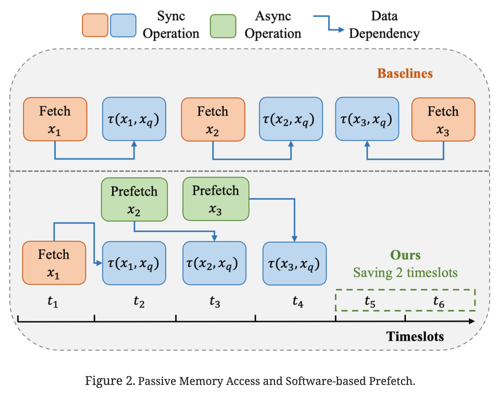

**vsag论文解读系列-1："VSAG: An Optimized Search Framework for Graph-based Approximate Nearest Neighbor Search"**
- 一种针对基于图的 ANN 搜索的搜索框架优化
- 2026/01/20 豆包辅助解读（豆包内部打开“一译”翻译网站）

## 一、研究背景与问题
### 1. 近似最近邻搜索（ANNS）的重要性
- ANNS是向量数据库与AI基础设施的核心问题，广泛应用于检索增强生成（RAG）、非结构化数据（文档、图像、视频）检索，如支付宝人脸识别支付、谷歌图像搜索等场景。
- 受“维度灾难”影响，精确最近邻搜索在高维数据下成本极高，ANNS通过牺牲少量精度换取效率，成为大规模向量检索的主流方案。

### 2. 现有图基ANNS算法的痛点
现有图基算法（如HNSW、VAMANA）虽平衡了召回率与运行效率，但在生产环境中面临三大核心瓶颈：
- **内存访问效率低**：图遍历的随机内存访问导致频繁L3缓存缺失，内存操作占搜索时间的63.02%（以GIST1M数据集为例，单查询需2959次随机向量访问，L3缓存缺失率67.42%）。
- **参数调优成本高**：算法性能对参数（如最大节点度、候选池大小）敏感，但手动调优需重复重建索引，耗时极高（暴力调优需60小时以上，而最优参数可使QPS提升42.6%）。
- **距离计算开销大**：即使采用SQ4量化，距离计算仍占搜索时间的26.12%，高维向量场景下开销更显著。

## 二、VSAG框架核心设计
VSAG是蚂蚁集团提出的开源图基ANNS优化框架，通过三大核心优化解决上述痛点，已在蚂蚁集团大规模部署，架构如图1所示。

### 1. 高效内存访问优化
#### （1）确定性访问贪婪搜索（Deterministic Access Greedy Search）
- **软件预取（Software Prefetching）**：通过`_mm_prefetch`指令在关键计算前主动加载目标数据到L3缓存，重叠预取与计算流程，减少缓存等待时间；同时通过批处理与访问序列重排，避免无效预取。
- **步长预取（Stride Prefetch）**：动态调整预取步长`ω`与深度`ν`，匹配CPU计算吞吐量与预取速率，避免过早预取导致缓存回收、过晚预取影响性能收益的问题。
- **过滤无效预取**：仅对未访问过的邻居节点预取，剔除已访问节点的冗余预取操作，提升预取效率（如图3所示，跳过已访问的`x₂`、`x₃`，直接预取`x₄`）。

#### （2）部分冗余存储（PRS）
- **冗余向量存储**：在每个图节点中嵌入压缩的邻居向量，使邻居检索变为连续内存访问，充分利用硬件预取（Hardware Prefetching）能力，提升缓存命中率。
- **动态冗余比控制**：通过冗余比`δ`平衡计算与内存资源：
  - 计算密集、高吞吐量场景：提高`δ`（如`δ=1`），减少缓存竞争，降低CPU空闲时间。
  - 内存受限、低吞吐量场景：降低`δ`（如`δ=0`），减少索引内存占用，支持部署在低配置实例（如2C8G）。

### 2. 自动化参数调优
将参数分为三类，针对性设计调优策略，避免重复索引重建：

| 参数类型 | 示例 | 影响范围 | 调优策略 |
|----------|------|----------|----------|
| 环境级（ELP） | 预取步长`ω`、预取深度`ν` | 仅QPS，无召回影响 | 网格搜索，遍历参数组合，选择QPS最优配置 |
| 查询级（QLP） | 候选池大小`efₛ` | QPS与召回率 | GBDT分类器动态判断查询难度：简单查询用小`efₛ`，复杂查询用大`efₛ`，QPS提升5%+ |
| 索引级（ILP） | 最大节点度`m_c`、剪枝率`α_c` | QPS、召回率、索引构建时间 | 基于标签的索引压缩：一次构建带标签的索引，搜索时通过边缘标签过滤模拟不同参数配置，调优时间仅为暴力调优的1/19（GIST1M数据集） |

### 3. 高效距离计算优化
#### （1）低精度计算开销最小化
- **量化与SIMD结合**：采用标量量化（SQ，如FLOAT32→INT8/INT4），结合AVX512等SIMD指令，单指令可并行处理4组向量对，低精度计算效率提升4倍。
- **距离分解**：预计算向量范数（`||x_b||²`），将欧氏距离计算`||x_b - x_q||² = ||x_b||² + ||x_q||² - 2x_b·x_q`转化为内积运算，减少CPU指令周期。

#### （2）选择性重排序（Selective Re-rank）
- 图遍历阶段用低精度距离筛选候选，仅对少量高潜力候选（基于误差-距离相关性动态选择）进行高精度距离重排序，在保证召回率的同时，降低高精度计算次数（`n_hp`），距离计算成本从1.62ms（HNSW）降至0.1ms（VSAG）。

## 三、实验结果
### 1. 数据集与基线
- **数据集**：涵盖图像（GIST1M、SIFT1M、TINY）、文本（GLOVE-100、WORD2VEC、OPENAI、ANT-INTERNET、MSMARCO），最大规模达1.13亿向量。
- **基线算法**：图基（hnswlib、hnsw(faiss)、nndescent）、分区基（faiss-ivf、faiss-ivfpqfs、scann）。

### 2. 核心性能对比（GIST1M数据集）

| 指标 | IVFPQFS | HNSW | VSAG |
|------|---------|------|------|
| 内存占用 | 3.8G | 4.0G | 4.5G |
| Recall@10（QPS=2000） | 84.57% | 59.46% | 89.80% |
| QPS（Recall@10=90%） | 1195 | 511.9 | 2167.3 |
| 距离计算成本 | 0.71ms | 1.62ms | 0.1ms |
| L3缓存缺失率 | 13.98% | 94.46% | 39.23% |
| 参数调优成本 | >20h | >60h | 2.92h |
| 参数调优方式 | 手动 | 手动 | 自动 |

### 3. 关键结论
- **性能领先**：在相同召回率下，VSAG比行业标准库hnswlib快4倍；MSMARCO（1亿向量）数据集上，Recall@10=99%时QPS从180提升至467（2.59倍）。
- **扩展性优异**：ANT-INTERNET（1000万向量）数据集上，Recall@10=96%时QPS达1421，是hnswlib的2.15倍。
- **调优高效**：索引级参数调优时间仅2-3倍索引构建时间，远低于暴力调优的`5³`倍（3个参数，每个5种选择）。

## 四、实际应用与部署
在蚂蚁集团100亿图像检索场景中（512维向量，分布式向量数据库存储）：
- 每个查询节点部署4个 segment（每 segment 1000万数据），配置16核CPU+80GB内存，集群共400个节点。
- 集成VSAG后，单segment平均延迟从3.0ms降至1.1ms，QPS上限提升2.65倍。

## 五、总结与贡献
1. **内存访问优化**：通过确定性访问、步长预取与PRS，将L3缓存缺失率从94.46%（HNSW）降至39.23%。
2. **自动化参数调优**：三级参数调优机制，避免重复索引重建，调优成本降低一个数量级。
3. **距离计算加速**：量化+SIMD+选择性重排序，距离计算成本降至0.1ms，支持高维向量高效检索。
4. **开源可用**：代码、数据等 artifacts 已开源，地址：https://github.com/antgroup/vsag。