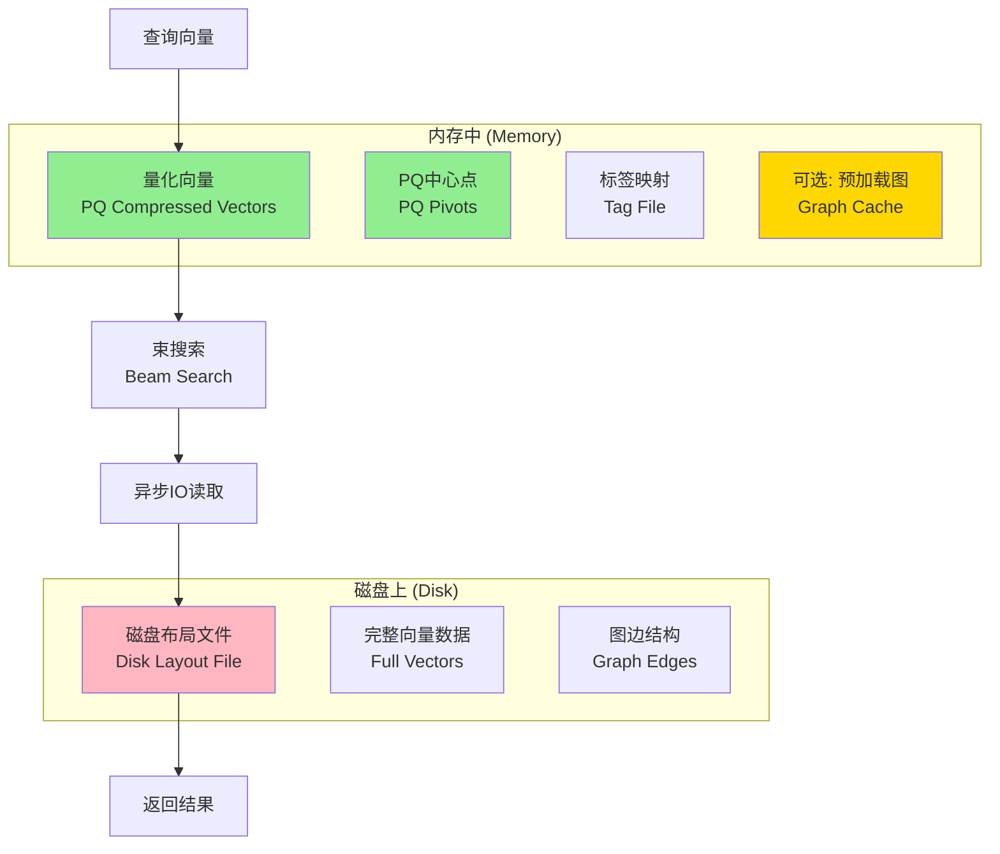
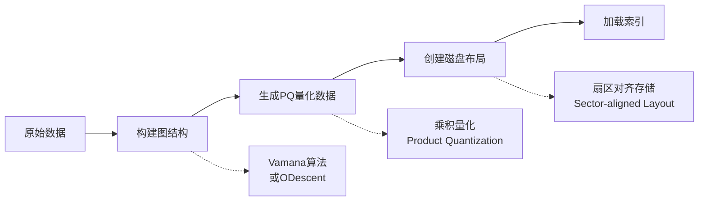
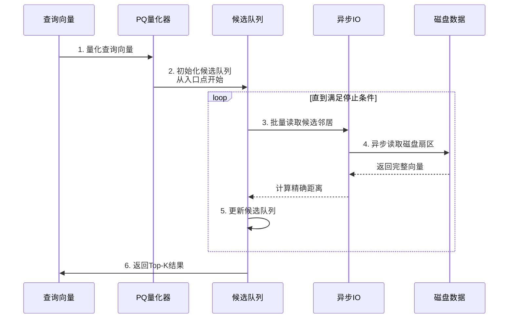
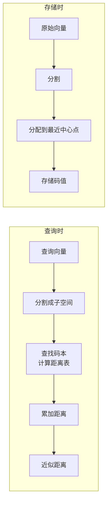
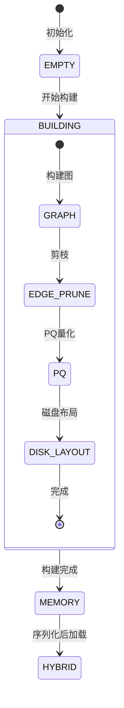

# DiskANN 索引技术详解

## 一句话总结

DiskANN 是一种**基于磁盘的近似最近邻搜索索引**，通过将图索引结构存储在磁盘上、量化向量存储在内存中，实现了**内存效率与查询性能的平衡**，能够处理远超内存容量的向量数据集。

---

## 生活比喻：图书馆的索引系统

想象你管理着一个巨大的图书馆：

- **传统 HNSW**：把所有书（向量）都放在阅览室（内存）的书架上，找书很快，但阅览室放不下太多书
- **DiskANN**：把书存放在仓库（磁盘），只在阅览室放书的缩略图（量化向量）和位置索引（图结构）。要找书时，先看缩略图确定大致位置，再去仓库取书

这样即使图书馆有几百万本书，也只需要很小的阅览室空间。

---

## 核心架构



---

## 构建流程详解

### 1. 整体构建流程



### 2. 关键构建步骤

```cpp
// 构建流程的代码结构
tl::expected<std::vector<int64_t>, Error>
DiskANN::build(const DatasetPtr& base) {
    // 1. 构建图索引（内存中）
    if (diskann_params_.graph_type == GRAPH_TYPE_ODESCENT) {
        // 使用ODescent算法构建
        ODescent graph(param, flatten_interface_ptr, ...);
        graph.Build();
        graph.SaveGraph(graph_stream_);
    } else if (diskann_params_.graph_type == DISKANN_GRAPH_TYPE_VAMANA) {
        // 使用Vamana算法构建
        build_index_->build(vectors, data_num, index_build_params, tags, use_reference_);
        build_index_->save(graph_stream_, tag_stream_);
    }
    
    // 2. 生成PQ量化数据
    diskann::generate_disk_quantized_data<float>(
        vectors, data_num, data_dim, failed_locs,
        pq_pivots_stream_, disk_pq_compressed_vectors_,
        metric_, p_val_, disk_pq_dims_, use_opq_, use_bsa_);
    
    // 3. 创建磁盘布局
    diskann::create_disk_layout<float>(
        vectors, data_num, data_dim, failed_locs,
        graph_stream_, disk_layout_stream_, sector_len_, metric_);
    
    // 4. 加载索引
    index_->load_from_separate_paths(
        pq_pivots_stream_, disk_pq_compressed_vectors_, tag_stream_);
}
```

---

## 搜索流程详解

### 1. 束搜索（Beam Search）



### 2. 搜索代码核心逻辑

```cpp
tl::expected<DatasetPtr, Error>
DiskANN::knn_search(...) {
    // 1. 解析搜索参数
    int64_t ef_search = params.ef_search;      // 搜索深度
    uint64_t beam_search = params.beam_search; // 束宽
    int64_t io_limit = params.io_limit;        // IO限制
    bool reorder = params.use_reorder;         // 是否重排序
    
    // 2. 选择搜索模式
    if (preload_) {
        if (params.use_async_io) {
            // 预加载 + 异步IO
            k = index_->cached_beam_search_async(
                query_vec, k, ef_search, labels, distances,
                beam_search, filter, io_limit, reorder, query_stats);
        } else {
            // 预加载 + 同步IO
            k = index_->cached_beam_search_memory(...);
        }
    } else {
        // 纯磁盘搜索
        k = index_->cached_beam_search(
            query_vec, k, ef_search, labels, distances,
            beam_search, filter, io_limit, reorder, query_stats);
    }
}
```

---

## 磁盘布局设计

### 1. 扇区对齐存储

```
┌─────────────────────────────────────────────────────────────┐
│                        扇区 (Sector)                         │
│  ┌───────────────────────────────────────────────────────┐  │
│  │  节点数据区                                            │  │
│  │  ┌─────────────────┬─────────────────────────────────┐│  │
│  │  │ 完整向量数据     │ 邻居ID列表 (变长)                 ││  │
│  │  │ [dim * 4 bytes] │ [n_neighbors * 4 bytes]          ││  │
│  │  └─────────────────┴─────────────────────────────────┘│  │
│  └───────────────────────────────────────────────────────┘  │
│                          ↓ 对齐到扇区边界                     │
└─────────────────────────────────────────────────────────────┘
        ↓
┌─────────────────────────────────────────────────────────────┐
│                        下一个扇区                            │
└─────────────────────────────────────────────────────────────┘
```

### 2. 为什么需要扇区对齐？

- **磁盘IO的最小单位**：磁盘以扇区（通常4KB）为单位读取
- **减少IO次数**：一次读取可以获取完整节点数据
- **提高缓存效率**：扇区对齐的数据更容易被预取缓存命中

```cpp
// 计算扇区大小
sector_len_ = std::max(
    MINIMAL_SECTOR_LEN,  // 最小4096字节
    (uint64_t)(dim_ * sizeof(float) + (R_ * GRAPH_SLACK + 1) * sizeof(uint32_t)) * VECTOR_PER_BLOCK
);
```

---

## PQ量化详解

### 1. 乘积量化原理

```
原始向量 (128维 float) = 512 bytes
           ↓
    分成8个子空间，每段16维
           ↓
    每个子空间量化到1字节 (256个中心点)
           ↓
量化后向量 = 8 bytes (压缩率 64:1)
```

### 2. PQ在DiskANN中的作用



### 3. 距离计算优化

```cpp
// 预计算查询向量到所有中心点的距离
void ProcessQueryImpl(const DataType* query, Computer<...>& computer) const {
    for (int64_t i = 0; i < pq_dim_; ++i) {
        const float* sub_query = query + i * subspace_dim_;
        float* distance_table = computer.buf_ + i * CENTROIDS_PER_SUBSPACE;
        
        // 计算查询向量到该子空间所有中心点的距离
        for (int64_t j = 0; j < CENTROIDS_PER_SUBSPACE; ++j) {
            const float* centroid = get_codebook_data(i, j);
            distance_table[j] = compute_distance(sub_query, centroid, subspace_dim_);
        }
    }
}

// 快速计算量化向量之间的距离
void ComputeDistImpl(Computer<...>& computer, const uint8_t* codes, float* dists) const {
    float dist = 0;
    for (int64_t i = 0; i < pq_dim_; ++i) {
        dist += computer.buf_[i * CENTROIDS_PER_SUBSPACE + codes[i]];
    }
    *dists = dist;
}
```

---

## 异步IO机制

### 1. 为什么需要异步IO？

```
同步IO：请求1 → 等待 → 完成 → 请求2 → 等待 → 完成 → ... (慢)
异步IO：请求1 → 请求2 → 请求3 → ... → 等待所有完成 (快)
```

### 2. 批量读取实现

```cpp
// 批量读取回调机制
batch_read_ = [&](const std::vector<read_request>& requests,
                  bool async,
                  const CallBack& callBack) -> void {
    if (async) {
        // 异步模式：并行发起所有读取请求
        for (const auto& req : requests) {
            auto [offset, len, dest] = req;
            disk_layout_reader_->AsyncRead(offset, len, dest, callBack);
        }
    } else {
        // 同步模式：顺序读取
        for (const auto& req : requests) {
            auto [offset, len, dest] = req;
            disk_layout_reader_->Read(offset, len, dest);
        }
    }
};
```

---

## 状态管理

### 1. 索引状态机



### 2. 状态定义

```cpp
enum IndexStatus { 
    EMPTY = 0,      // 空索引
    MEMORY = 1,     // 完全在内存中
    HYBRID = 2,     // 混合模式（内存+磁盘）
    BUILDING = 3    // 构建中
};

enum BuildStatus { 
    BEGIN = 0,      // 开始
    GRAPH = 1,      // 图构建
    EDGE_PRUNE = 2, // 边剪枝
    PQ = 3,         // PQ量化
    DISK_LAYOUT = 4,// 磁盘布局
    FINISH = 5      // 完成
};
```

---

## 关键参数说明

| 参数 | 含义 | 典型值 | 影响 |
|------|------|--------|------|
| `ef_construction` (L_) | 构建时的搜索深度 | 100-200 | 越大图质量越好，构建越慢 |
| `max_degree` (R_) | 最大出度 | 32-64 | 越大搜索越快，内存占用越多 |
| `pq_dims` | PQ子空间数 | 8-32 | 平衡压缩率和精度 |
| `beam_search` | 束搜索宽度 | 4-16 | 越大搜索越精确，IO越多 |
| `io_limit` | IO限制 | 2*k ~ 10*k | 控制磁盘读取次数 |
| `sector_len` | 扇区大小 | 4KB+ | 影响磁盘对齐 |

---

## 性能优化技巧

### 1. 预加载（Preload）

```cpp
if (preload_) {
    index_->load_graph(graph_stream_);  // 将图结构预加载到内存
} else {
    graph_stream_.clear();  // 释放内存
}
```

### 2. 重排序（Reorder）

```cpp
// 先用PQ近似距离筛选候选，再用精确距离重排序
if (reorder && preload_) {
    ef_search = std::max(2 * k, ef_search);
    io_limit = std::max(2 * k, io_limit);  // 读取更多候选
    // 然后用精确距离重新排序
}
```

### 3. 参考点优化（Reference Point）

使用参考点减少距离计算量：
```cpp
// 存储向量相对于参考点的差值而非完整向量
// dist(A, B) ≈ dist(A-ref, B-ref)  // 通过三角不等式优化
```

---

## 文件组织结构

```
DiskANN索引文件包含以下部分：

1. PQ_PIVOT (pq_pivots_stream_)
   - PQ码本数据
   - 中心点信息
   
2. COMPRESSED_VECTOR (disk_pq_compressed_vectors_)
   - 量化后的向量数据
   
3. LAYOUT_FILE (disk_layout_stream_)
   - 磁盘布局数据
   - 完整向量 + 图边
   
4. TAG_FILE (tag_stream_)
   - 向量ID映射
   
5. GRAPH (graph_stream_) [可选，预加载时]
   - 图结构数据
```

---

## 要点回顾

1. **DiskANN = 内存PQ + 磁盘图**：通过量化减少内存占用，通过图索引保证搜索质量
2. **扇区对齐是关键**：磁盘IO以扇区为单位，对齐可以最大化IO效率
3. **束搜索+异步IO**：批量读取候选节点，重叠计算和IO
4. **构建分阶段**：图构建 → PQ量化 → 磁盘布局 → 加载索引
5. **参数权衡**：beam_search/io_limit/ef_search 需要在延迟、吞吐、精度间权衡
