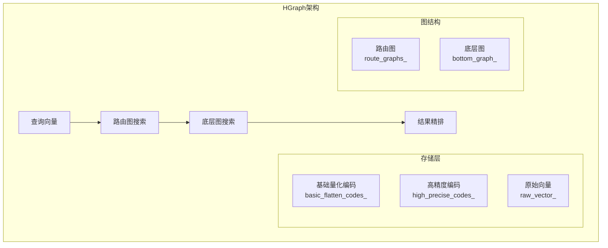
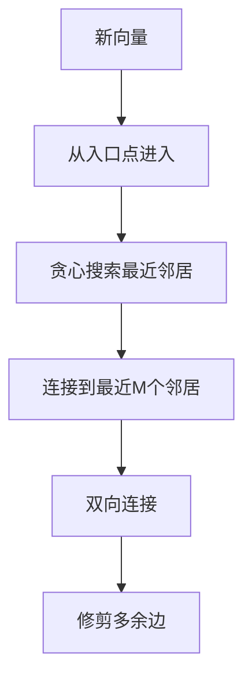
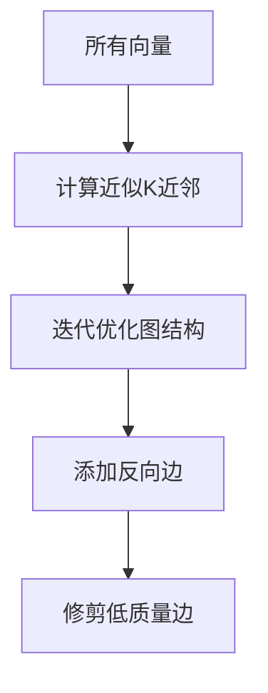
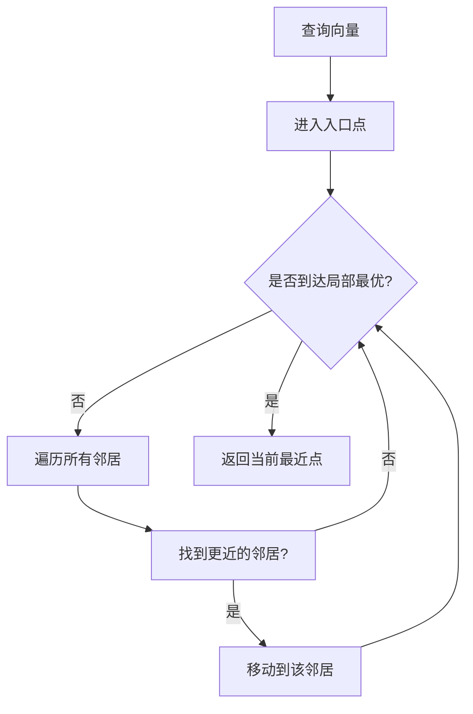

# HGraph 索引详解

> 创建日期：2026-03-14

## 一句话总结

HGraph 是一种**分层图索引**，它结合了 HNSW 的多层导航思想和 ODescent 的图构建算法，通过双层量化（粗量化+精量化）和路由图优化，实现了高效的近似最近邻搜索。

---

## 生活比喻：快递分拣中心

想象 HGraph 就像一个**大型快递分拣中心**：

- **底层图（Bottom Graph）**：就像全国性的物流网络，每个快递站（节点）连接着附近的几条路线（邻居）
- **路由图（Route Graphs）**：就像省级、市级的分拣中心，帮你快速定位到大致区域
- **量化编码**：就像给包裹贴上简化标签，用更小的空间存储信息
- **ODescent 构建**：就像优化物流路线，让每个站点连接到最常用、最高效的邻近站点

```
┌─────────────────────────────────────────────────────────┐
│                    路由图层（高层）                      │
│         ┌───┐     ┌───┐     ┌───┐                      │
│         │ A │─────│ B │─────│ C │    ← 远距离导航       │
│         └───┘     └───┘     └───┘                      │
└─────────────────────────────────────────────────────────┘
                           ↓
┌─────────────────────────────────────────────────────────┐
│                    底层图（密集层）                        │
│    ┌───┐ ┌───┐ ┌───┐ ┌───┐ ┌───┐ ┌───┐                 │
│    │ 1 │─│ 2 │─│ 3 │─│ 4 │─│ 5 │─│ 6 │   ← 精确搜索     │
│    └───┘ └───┘ └───┘ └───┘ └───┘ └───┘                 │
└─────────────────────────────────────────────────────────┘
```

---

## 核心架构

### 1. 双层存储结构



### 2. 关键组件

| 组件 | 作用 | 类比 |
|------|------|------|
| `bottom_graph_` | 存储所有向量的邻接关系 | 全国物流网络 |
| `route_graphs_` | 多层导航图，快速定位 | 省市级分拣中心 |
| `basic_flatten_codes_` | 压缩存储的向量编码 | 简化包裹标签 |
| `high_precise_codes_` | 高精度向量用于重排序 | 详细包裹信息 |
| `searcher_` | 执行图搜索 | 物流调度系统 |

---

## 构建流程

### 1. 训练阶段（Train）


```cpp
void HGraph::Train(const DatasetPtr& base) {
    // 1. 采样训练数据
    DatasetPtr train_data = vsag::sample_train_data(base, ...);
    
    // 2. 训练基础量化编码
    this->basic_flatten_codes_->Train(data_ptr, train_data->GetNumElements());
    
    // 3. 训练高精度编码（用于重排序）
    if (use_reorder_) {
        this->high_precise_codes_->Train(data_ptr, train_data->GetNumElements());
    }
}
```

### 2. 构建阶段（Build）

HGraph 支持两种图构建方式：

#### 方式一：NSW（导航小世界）



#### 方式二：ODescent（默认）



```cpp
std::vector<int64_t> HGraph::Build(const DatasetPtr& data) {
    this->Train(data);
    if (graph_type_ == GRAPH_TYPE_VALUE_NSW) {
        return this->Add(data);  // NSW方式
    } else {
        return this->build_by_odescent(data);  // ODescent方式
    }
}
```

---

## 搜索流程

### 贪心搜索算法



### 代码核心逻辑

```cpp
// 简化示意
DatasetPtr HGraph::KnnSearch(const DatasetPtr& query, int64_t k, ...) {
    // 1. 使用基础编码计算距离
    auto codes = basic_flatten_codes_;
    
    // 2. 贪心搜索找到候选集
    auto candidates = searcher_->Search(query, ef_search);
    
    // 3. 如果需要重排序，使用高精度编码
    if (use_reorder_) {
        candidates = reorder_->Reorder(candidates, query, k);
    }
    
    // 4. 返回Top-K结果
    return candidates.TopK(k);
}
```

---

## 核心参数

| 参数名 | 作用 | 建议值 |
|--------|------|--------|
| `ef_construction` | 构建时的搜索深度 | 400 |
| `max_degree` | 每个节点的最大邻居数 | 64 |
| `alpha` | 图修剪的激进程度 | 1.2 |
| `use_reorder` | 是否启用重排序 | true（精度优先） |
| `graph_type` | 图构建算法 | ODescent |

---

## 优化特性

### 1. ELP 优化器


### 2. 并行搜索

```cpp
// 使用线程池并行处理
this->parallel_searcher_ = 
    std::make_shared<ParallelSearcher>(common_param, thread_pool_, neighbors_mutex_);
```

### 3. 量化策略

支持多种量化方式：
- **FP32**：原始精度
- **SQ4/SQ8**：标量量化，4/8位
- **PQ**：乘积量化
- **RabitQ**：随机二进制量化

---

## 数据结构可视化

```
┌────────────────────────────────────────────────────────────┐
│                      HGraph 内存布局                         │
├────────────────────────────────────────────────────────────┤
│  ┌─────────────────┐                                       │
│  │   路由图数组     │  route_graphs_[level]                  │
│  │  ┌───┐┌───┐    │  每层一个稀疏图                         │
│  │  │ 0 ││ 1 │... │                                       │
│  │  └───┘└───┘    │                                       │
│  └─────────────────┘                                       │
│  ┌─────────────────┐                                       │
│  │    底层图       │  bottom_graph_                         │
│  │  完整的向量图    │  存储所有向量及其邻居                   │
│  └─────────────────┘                                       │
│  ┌─────────────────┐                                       │
│  │  基础编码存储    │  basic_flatten_codes_                  │
│  │  压缩向量数据    │  用于快速距离计算                       │
│  └─────────────────┘                                       │
│  ┌─────────────────┐                                       │
│  │  高精度编码      │  high_precise_codes_                   │
│  │  用于重排序      │  提升搜索结果精度                       │
│  └─────────────────┘                                       │
└────────────────────────────────────────────────────────────┘
```

---

## 适用场景

| 场景 | 适合度 | 说明 |
|------|--------|------|
| 大规模向量库 | ⭐⭐⭐⭐⭐ | 分层结构高效处理百万级数据 |
| 内存受限环境 | ⭐⭐⭐⭐ | 量化压缩减少内存占用 |
| 高召回率要求 | ⭐⭐⭐⭐⭐ | 重排序机制提升精度 |
| 实时增量添加 | ⭐⭐⭐ | 支持增量添加，但批量构建更优 |
| 过滤搜索 | ⭐⭐⭐⭐ | 支持属性过滤 |

---

## 代码文件位置

- 头文件：[src/algorithm/hgraph.h](file:///Users/zhuliming/Documents/my_codes/vsag/src/algorithm/hgraph.h)
- 实现：[src/algorithm/hgraph.cpp](file:///Users/zhuliming/Documents/my_codes/vsag/src/algorithm/hgraph.cpp)
- 参数：[src/algorithm/hgraph_parameter.h](file:///Users/zhuliming/Documents/my_codes/vsag/src/algorithm/hgraph_parameter.h)
