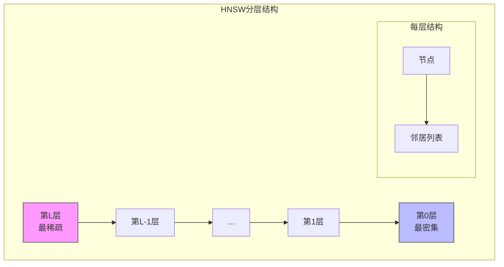
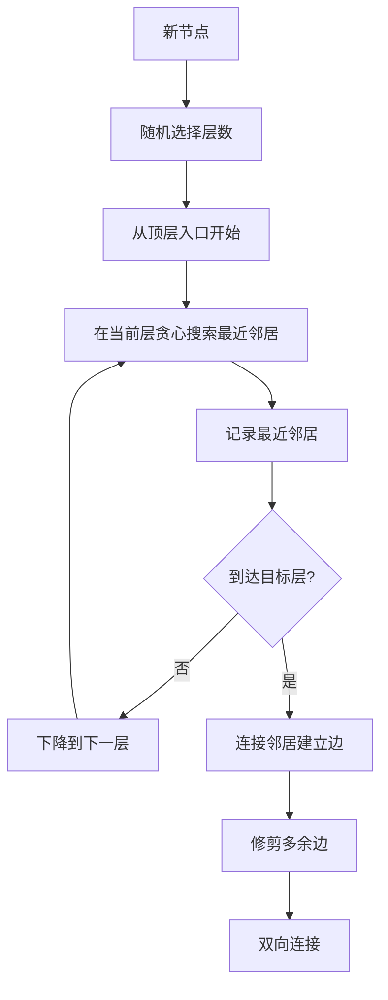
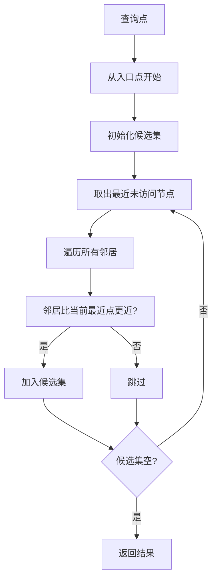

# HNSW 索引详解

> 创建日期：2026-03-14

## 一句话总结

HNSW（Hierarchical Navigable Small World）是一种**分层可导航小世界图索引**，通过构建多层近似图结构，利用贪心算法在图上快速导航，实现近似最近邻搜索。

---

## 生活比喻：社交网络六度分隔

想象 HNSW 就像**社交网络中的好友关系**：

- **每个人**：就像一个向量数据点
- **好友关系**：就像向量之间的邻近关系
- **名人/枢纽节点**：就像高层图中的入口点，连接着很多人
- **分层结构**：
  - 第0层（最底层）：所有人的完整好友网络
  - 第1层：比较活跃的人的好友网络
  - 第2层（最高层）：只有名人和超级枢纽

```
┌─────────────────────────────────────────────────────────┐
│                  HNSW 社交网络类比                        │
├─────────────────────────────────────────────────────────┤
│                                                         │
│  第2层（顶层）: 只有名人和超级枢纽                         │
│                                                         │
│       ┌─────┐         ┌─────┐                          │
│       │马云 ○─────────○ 马斯克│                          │
│       └──┬──┘         └──┬──┘                          │
│          │               │                             │
│          └───────┬───────┘                             │
│                  ▼                                     │
│               ┌─────┐                                  │
│               │雷军 ○│                                  │
│               └──┬──┘                                  │
│                  │                                     │
│  第1层（中层）: 活跃用户的网络                            │
│                  │                                     │
│           ┌──────┼──────┐                              │
│           ▼      ▼      ▼                              │
│         ┌───┐  ┌───┐  ┌───┐                           │
│         │ A ○──○ B ○──○ C │                           │
│         └───┘  └───┘  └───┘                           │
│           │      │      │                              │
│  第0层（底层）: 所有人的完整网络                          │
│           │      │      │                              │
│      ┌────┴────┐ │ ┌───┴───┐                           │
│      ▼         ▼ ▼ ▼       ▼                           │
│    ┌───┐    ┌───┐ ┌───┐  ┌───┐                        │
│    │a1 ○────○a2 ○─○b1 ○──○c1 │                        │
│    └───┘    └───┘ └───┘  └───┘                        │
│      │        │    │      │                            │
│    ┌─┴─┐    ┌─┴─┐ ┌┴┐   ┌─┴─┐                         │
│    ▼   ▼    ▼   ▼ ▼ ▼   ▼   ▼                         │
│   ...  ...  ...  ...    ...  ...                       │
│                                                         │
│  搜索过程：从顶层名人开始 → 逐层下降 → 找到最近的人        │
│                                                         │
└─────────────────────────────────────────────────────────┘
```

---

## 核心架构

### 1. 多层图结构



### 2. 关键组件

| 组件 | 作用 | 类比 |
|------|------|------|
| `alg_hnsw_` | HNSW算法核心 | 社交网络引擎 |
| `space_` | 距离计算空间 | 相似度度量标准 |
| `max_degree_` | 最大邻居数(M) | 每人最多好友数 |
| `ef_construction` | 构建搜索范围 | 交友时的考察范围 |
| `conjugate_graph_` | 共轭图（可选） | 增强搜索的辅助网络 |

---

## 核心算法

### 1. 节点插入算法



### 2. 贪心搜索算法



---

## 构建流程

### 代码核心逻辑

```cpp
tl::expected<std::vector<int64_t>, Error> HNSW::build(const DatasetPtr& base) {
    // 1. 参数检查
    CHECK_ARGUMENT(base_dim == dim_, "维度不匹配");
    
    int64_t num_elements = base->GetNumElements();
    std::vector<int64_t> failed_ids;
    
    // 2. 逐个添加节点
    {
        SlowTaskTimer t("hnsw graph");
        for (int64_t i = 0; i < num_elements; ++i) {
            if (!alg_hnsw_->addPoint((const void*)vectors[i], ids[i])) {
                failed_ids.emplace_back(ids[i]);  // 重复ID
            }
        }
    }
    
    // 3. 静态索引编码（可选）
    if (use_static_) {
        auto* hnsw = static_cast<hnswlib::StaticHierarchicalNSW*>(alg_hnsw_.get());
        hnsw->encode_hnsw_data();  // 压缩编码
    }
    
    return failed_ids;
}
```

### 节点插入详解

```cpp
// 简化示意
bool HierarchicalNSW::addPoint(const void* data_point, LabelType label) {
    // 1. 随机选择层数（指数分布）
    int level = getRandomLevel(mult_);
    
    // 2. 找到入口点
    int curr_ep = enterpoint_node_;
    
    // 3. 从顶层开始搜索
    for (int i = max_level_; i > level; --i) {
        curr_ep = searchLayerClosest(data_point, curr_ep, i);
    }
    
    // 4. 在目标层及以下建立连接
    for (int i = std::min(level, max_level_); i >= 0; --i) {
        // 搜索最近邻居
        auto neighbors = searchLayer(data_point, curr_ep, ef_construction_, i);
        
        // 选择M个最近邻居连接
        auto selected = selectNeighbors(neighbors, M_);
        
        // 建立双向连接
        connectNewElement(curr_ep, selected, i);
        
        // 修剪邻居的边（保持图稀疏）
        for (auto neighbor : selected) {
            pruneConnections(neighbor, max_degree_);
        }
    }
    
    // 5. 更新入口点（如果是最高层）
    if (level > max_level_) {
        enterpoint_node_ = new_node_id;
        max_level_ = level;
    }
    
    return true;
}
```

---

## 搜索流程

### KNN搜索

```cpp
tl::expected<DatasetPtr, Error> HNSW::knn_search(...) {
    // 1. 检查空索引
    if (empty_index_) return empty_result;
    
    // 2. 解析参数
    auto params = HnswSearchParameters::FromJson(parameters);
    
    // 3. 执行搜索
    std::shared_lock lock(rw_mutex_);
    
    // 4. 调用核心搜索
    results = alg_hnsw_->searchKnn(
        vector,           // 查询向量
        k,                // 返回数量
        max(params.ef_search, k),  // 搜索范围
        filter_ptr,       // 过滤器
        skip_ratio,       // 跳过比例
        allocator,        // 内存分配器
        iter_filter_ctx,  // 迭代过滤上下文
        is_last_filter    // 是否最后过滤
    );
    
    // 5. 共轭图增强（可选）
    if (use_conjugate_graph_ && params.use_conjugate_graph_search) {
        conjugate_graph_->EnhanceResult(results, distance_func);
    }
    
    // 6. 返回Top-K
    return format_results(results, k);
}
```

### 搜索算法详解

```cpp
// 简化示意
std::priority_queue<std::pair<dist_t, LabelType>>
HierarchicalNSW::searchKnn(const void* query_data, size_t k, size_t ef, ...) {
    // 1. 初始化
    std::priority_queue<std::pair<dist_t, LabelType>> top_candidates;
    std::priority_queue<std::pair<dist_t, tableint>> candidate_set;
    
    // 2. 从入口点开始
    dist_t dist = distance(query_data, getDataByInternalId(enterpoint_node_));
    candidate_set.emplace(-dist, enterpoint_node_);
    top_candidates.emplace(dist, enterpoint_node_);
    
    // 3. 贪心搜索
    while (!candidate_set.empty()) {
        auto current_pair = candidate_set.top();
        
        // 终止条件：当前候选比结果集最远的还远
        if (-current_pair.first > top_candidates.top().first) break;
        
        candidate_set.pop();
        tableint current_node = current_pair.second;
        
        // 遍历邻居
        for (auto neighbor : getNeighbors(current_node)) {
            if (visited[neighbor]) continue;
            visited[neighbor] = true;
            
            dist_t dist = distance(query_data, getDataByInternalId(neighbor));
            
            // 加入候选集
            if (top_candidates.size() < ef || dist < top_candidates.top().first) {
                candidate_set.emplace(-dist, neighbor);
                top_candidates.emplace(dist, getExternalLabel(neighbor));
                
                if (top_candidates.size() > ef) {
                    top_candidates.pop();
                }
            }
        }
    }
    
    return top_candidates;
}
```

---

## 核心参数

| 参数名 | 作用 | 建议值 |
|--------|------|--------|
| `M` | 最大邻居数 | 16-64 |
| `ef_construction` | 构建搜索范围 | 100-400 |
| `ef_search` | 搜索范围 | 50-500 |
| `max_elements` | 最大元素数 | 根据数据量 |
| `use_static` | 静态索引模式 | false（动态）/ true（静态优化） |

### 参数关系

```
┌─────────────────────────────────────────────────────────┐
│                   参数影响关系图                         │
├─────────────────────────────────────────────────────────┤
│                                                         │
│  M（邻居数）                                            │
│     ↑                                                   │
│     ├──→ 内存占用 ↑                                     │
│     ├──→ 构建时间 ↑                                     │
│     ├──→ 搜索精度 ↑                                     │
│     └──→ 搜索速度 ↓（略）                                │
│                                                         │
│  ef_construction（构建范围）                             │
│     ↑                                                   │
│     ├──→ 构建时间 ↑↑                                    │
│     ├──→ 图质量 ↑                                       │
│     └──→ 搜索精度 ↑                                     │
│                                                         │
│  ef_search（搜索范围）                                   │
│     ↑                                                   │
│     ├──→ 搜索时间 ↑                                     │
│     └──→ 搜索精度 ↑                                     │
│                                                         │
└─────────────────────────────────────────────────────────┘
```

---

## 特殊特性

### 1. 静态索引（Static HNSW）

```cpp
if (use_static_) {
    // 静态索引优化，适用于只读场景
    alg_hnsw_ = std::make_shared<hnswlib::StaticHierarchicalNSW>(
        space_.get(),
        DEFAULT_MAX_ELEMENT,
        allocator_.get(),
        M,
        hnsw_params.ef_construction,
        Options::Instance().block_size_limit()
    );
    
    // 构建完成后编码压缩
    hnsw->encode_hnsw_data();
}
```

**优势**：
- 内存更紧凑
- 搜索更快
- 适合只读场景

**限制**：
- 不支持动态添加
- 维度必须是4的倍数

### 2. 共轭图增强

```cpp
if (use_conjugate_graph_) {
    conjugate_graph_ = std::make_shared<ConjugateGraph>(allocator_.get());
}

// 搜索后增强结果
conjugate_graph_->EnhanceResult(results, distance_func);
```

共轭图通过记录历史查询反馈，优化搜索结果。

### 3. 删除支持

```cpp
// 标记删除（软删除）
alg_hnsw_->markDelete(id);

// 恢复删除
alg_hnsw_->recoverMarkDelete(id);
```

---

## 数据结构可视化

```
┌────────────────────────────────────────────────────────────┐
│                    HNSW 内存布局                            │
├────────────────────────────────────────────────────────────┤
│                                                            │
│  ┌─────────────────────────────────────────────────────┐  │
│  │                  节点数据存储                         │  │
│  │  ┌─────────┐ ┌─────────┐ ┌─────────┐     ┌────────┐ │  │
│  │  │ 节点 0  │ │ 节点 1  │ │ 节点 2  │ ... │ 节点 N │ │  │
│  │  │ 向量数据│ │ 向量数据│ │ 向量数据│     │向量数据│ │  │
│  │  └─────────┘ └─────────┘ └─────────┘     └────────┘ │  │
│  └─────────────────────────────────────────────────────┘  │
│                                                            │
│  ┌─────────────────────────────────────────────────────┐  │
│  │                  层级链接结构                         │  │
│  │                                                     │  │
│  │  第0层: [节点0] → [邻居1, 邻居2, 邻居3, ...]        │  │
│  │  第0层: [节点1] → [邻居0, 邻居4, 邻居5, ...]        │  │
│  │  第0层: [节点2] → [邻居0, 邻居6, 邻居7, ...]        │  │
│  │       ...                                           │  │
│  │  第1层: [节点0] → [邻居8, 邻居9]                    │  │
│  │  第1层: [节点8] → [邻居0, 邻居10]                   │  │
│  │       ...                                           │  │
│  │  第2层: [节点0] → [邻居8]                           │  │
│  │                                                     │  │
│  └─────────────────────────────────────────────────────┘  │
│                                                            │
│  ┌─────────────────────────────────────────────────────┐  │
│  │                  标签映射表                           │  │
│  │  外部标签 → 内部ID                                    │  │
│  │  {label_1: 0, label_2: 1, label_3: 2, ...}          │  │
│  └─────────────────────────────────────────────────────┘  │
│                                                            │
└────────────────────────────────────────────────────────────┘
```

---

## 适用场景

| 场景 | 适合度 | 说明 |
|------|--------|------|
| 通用稠密向量 | ⭐⭐⭐⭐⭐ | HNSW是最通用的ANN算法 |
| 高维数据 | ⭐⭐⭐⭐⭐ | 适合100-1000维向量 |
| 动态数据 | ⭐⭐⭐⭐ | 支持增量添加（非静态模式） |
| 高召回率 | ⭐⭐⭐⭐⭐ | 调整ef_search可达很高精度 |
| 内存充足 | ⭐⭐⭐⭐⭐ | 图结构需要较多内存 |
| 稀疏向量 | ⭐ | 不适合，请用SINdi |

---

## 性能特点

### 优势

1. **通用性强**：适用于各种数据分布
2. **精度高**：在合理参数下召回率很高
3. **构建简单**：相比其他图索引更容易调参
4. **社区成熟**：最广泛使用的ANN算法之一

### 局限

1. **内存占用大**：需要存储多层图结构
2. **构建较慢**：特别是ef_construction较大时
3. **不支持过滤**：原生不支持属性过滤（VSAG已扩展）

---

## 代码文件位置

- 头文件：[src/index/hnsw.h](file:///Users/zhuliming/Documents/my_codes/vsag/src/index/hnsw.h)
- 实现：[src/index/hnsw.cpp](file:///Users/zhuliming/Documents/my_codes/vsag/src/index/hnsw.cpp)
- 参数：[src/index/hnsw_zparameters.h](file:///Users/zhuliming/Documents/my_codes/vsag/src/index/hnsw_zparameters.h)
- 核心算法：[src/algorithm/hnswlib/hnswalg.h](file:///Users/zhuliming/Documents/my_codes/vsag/src/algorithm/hnswlib/hnswalg.h)
