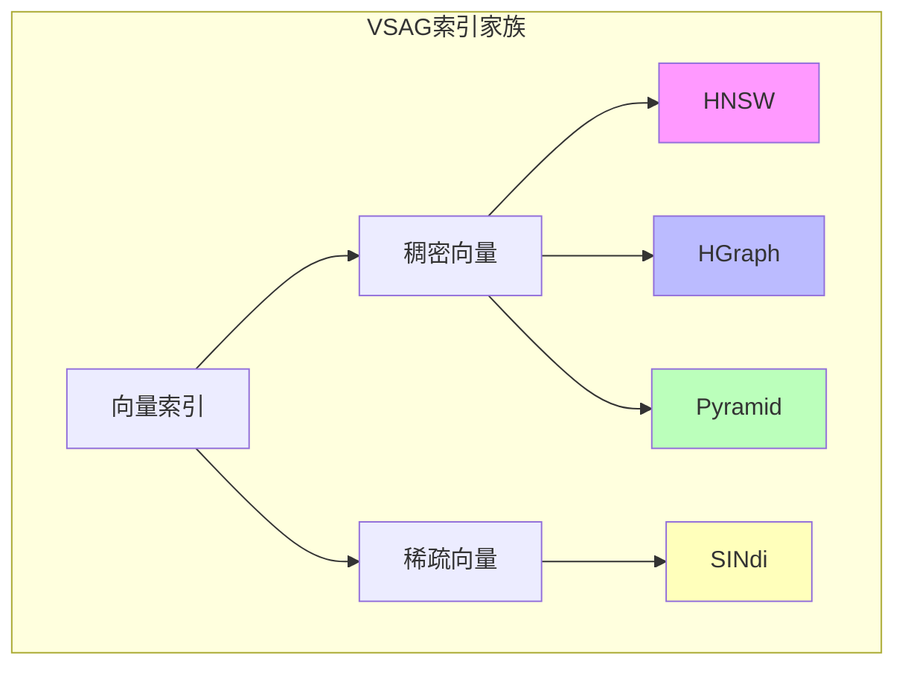
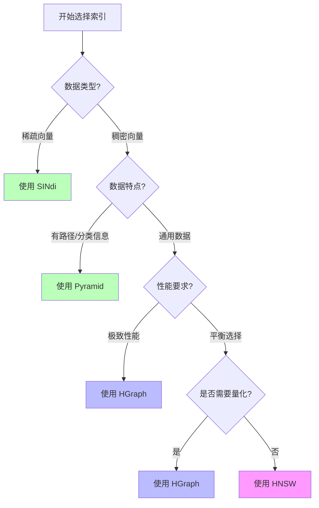
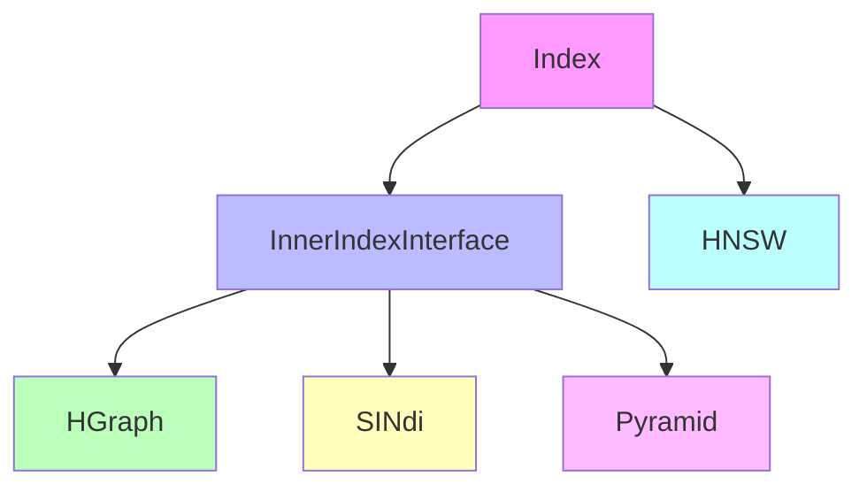

# VSAG 索引对比总结

> 创建日期：2026-03-14

## 四大索引概览



| 索引 | 数据类型 | 核心结构 | 引入版本 | 适用场景 |
|------|----------|----------|----------|----------|
| **HNSW** | 稠密向量 | 分层小世界图 | 早期 | 通用ANN搜索 |
| **HGraph** | 稠密向量 | 分层图+ODescent | v0.12 | 大规模高性能 |
| **Pyramid** | 稠密向量 | 树形分层图 | v0.14 | 路径过滤搜索 |
| **SINdi** | 稀疏向量 | 分窗口倒排 | - | 稀疏向量搜索 |

---

## 核心原理对比

### 1. 结构对比

```
┌─────────────────────────────────────────────────────────────────────────────┐
│                           四大索引结构对比                                    │
├─────────────────────────────────────────────────────────────────────────────┤
│                                                                             │
│  HNSW（分层图）                                                               │
│  ┌─────────┐                                                                │
│  │  顶层   │  ← 稀疏的导航层                                                  │
│  │ ○───○   │                                                                │
│  └────┬────┘                                                                │
│       ↓                                                                     │
│  ┌─────────┐                                                                │
│  │  中层   │  ← 中等密度                                                      │
│  │ ○─○─○   │                                                                │
│  └────┬────┘                                                                │
│       ↓                                                                     │
│  ┌─────────┐                                                                │
│  │  底层   │  ← 完整的图结构                                                  │
│  │ ○─○─○─○ │                                                                │
│  └─────────┘                                                                │
│                                                                             │
├─────────────────────────────────────────────────────────────────────────────┤
│                                                                             │
│  HGraph（分层图+量化）                                                         │
│  ┌─────────────────────────────────────────┐                                │
│  │           路由图（多层导航）              │                                │
│  │         ○────○────○                    │                                │
│  └──────────────────┬──────────────────────┘                                │
│                     ↓                                                       │
│  ┌─────────────────────────────────────────┐                                │
│  │           底层图（完整数据）              │                                │
│  │    ○───○───○───○───○───○              │                                │
│  │    │   │   │   │   │   │               │                                │
│  └────┼───┼───┼───┼───┼───┼───────────────┘                                │
│       ↓   ↓   ↓   ↓   ↓   ↓                                                 │
│  [基础编码]  [高精度编码]  [原始向量]                                          │
│  （压缩存储）   （重排序用）   （可选）                                         │
│                                                                             │
├─────────────────────────────────────────────────────────────────────────────┤
│                                                                             │
│  Pyramid（树形图）                                                            │
│                                                                             │
│           ┌─────────┐                                                       │
│           │  Root   │  ← 根节点（导航）                                       │
│           └────┬────┘                                                       │
│       ┌────────┼────────┐                                                   │
│       ↓        ↓        ↓                                                   │
│   ┌───────┐ ┌───────┐ ┌───────┐                                             │
│   │Node_A │ │Node_B │ │Node_C │  ← 子节点（分类）                             │
│   └───┬───┘ └───┬───┘ └───┬───┘                                             │
│       │         │         │                                                 │
│     ┌─┴─┐     ┌─┴─┐     ┌─┴─┐                                               │
│     ↓   ↓     ↓   ↓     ↓   ↓                                               │
│   [图] [图] [图] [列表] [图] ...                                            │
│   或暴力搜索                                                                 │
│                                                                             │
├─────────────────────────────────────────────────────────────────────────────┤
│                                                                             │
│  SINdi（分窗口倒排）                                                           │
│                                                                             │
│   窗口0          窗口1          窗口2                                        │
│  ┌──────┐      ┌──────┐      ┌──────┐                                       │
│  │Doc 0 │      │Doc100│      │Doc200│                                       │
│  │Doc 99│      │Doc199│      │Doc299│                                       │
│  └──┬───┘      └──┬───┘      └──┬───┘                                       │
│     │             │             │                                           │
│     ↓             ↓             ↓                                           │
│  倒排列表       倒排列表       倒排列表                                        │
│  Term0→[0,5]   Term0→[100]   Term0→[200,205]                                │
│  Term1→[3,8]   Term1→[105]   Term1→[210]                                    │
│  Term2→[12]    Term2→[110]   Term2→[220,225]                                │
│                                                                             │
└─────────────────────────────────────────────────────────────────────────────┘
```

### 2. 搜索流程对比

```mermaid
flowchart TB
    subgraph HNSW搜索
        A1[查询向量] --> B1[顶层入口]
        B1 --> C1[贪心下降]
        C1 --> D1[底层搜索]
        D1 --> E1[返回结果]
    end
    
    subgraph HGraph搜索
        A2[查询向量] --> B2[路由图导航]
        B2 --> C2[底层图搜索]
        C2 --> D2[重排序]
        D2 --> E2[返回结果]
    end
    
    subgraph Pyramid搜索
        A3[查询+路径] --> B3[路径导航]
        B3 --> C3[定位子索引]
        C3 --> D3[图/暴力搜索]
        D3 --> E3[返回结果]
    end
    
    subgraph SINdi搜索
        A4[稀疏查询] --> B4[词项计算]
        B4 --> C4[遍历窗口]
        C4 --> D4[倒排求交]
        D4 --> E4[返回结果]
    end
```



---

## 性能对比

### 1. 构建性能

| 索引 | 构建速度 | 内存占用 | 复杂度 | 特点 |
|------|----------|----------|--------|------|
| HNSW | ⭐⭐⭐ | ⭐⭐⭐ | O(n log n) | 逐个插入，可增量 |
| HGraph | ⭐⭐⭐⭐ | ⭐⭐⭐⭐ | O(n log n) | ODescent批量构建更快 |
| Pyramid | ⭐⭐⭐ | ⭐⭐⭐ | O(n log n) | 路径分组有额外开销 |
| SINdi | ⭐⭐⭐⭐⭐ | ⭐⭐⭐⭐⭐ | O(n) | 倒排结构构建简单 |

### 2. 搜索性能

| 索引 | 搜索速度 | 召回率 | 扩展性 | 特点 |
|------|----------|--------|--------|------|
| HNSW | ⭐⭐⭐⭐ | ⭐⭐⭐⭐⭐ | ⭐⭐⭐⭐ | 经典算法，稳定可靠 |
| HGraph | ⭐⭐⭐⭐⭐ | ⭐⭐⭐⭐⭐ | ⭐⭐⭐⭐⭐ | 优化版，性能最佳 |
| Pyramid | ⭐⭐⭐⭐ | ⭐⭐⭐⭐ | ⭐⭐⭐⭐ | 路径过滤有优势 |
| SINdi | ⭐⭐⭐⭐⭐ | ⭐⭐⭐⭐ | ⭐⭐⭐ | 稀疏向量专用，极快 |

### 3. 内存效率

```
┌─────────────────────────────────────────────────────────┐
│                    内存占用对比（相对值）                  │
├─────────────────────────────────────────────────────────┤
│                                                         │
│  HNSW      ████████████████████████████████████  100%  │
│  HGraph    ██████████████████████████████        85%   │
│  Pyramid   ████████████████████████████████      90%   │
│  SINdi     ██████████                            25%   │
│                                                         │
│  （假设相同数据量，HNSW作为基准100%）                      │
└─────────────────────────────────────────────────────────┘
```

---

## 功能特性对比

| 特性 | HNSW | HGraph | Pyramid | SINdi |
|------|------|--------|---------|-------|
| **稠密向量** | ✅ | ✅ | ✅ | ❌ |
| **稀疏向量** | ❌ | ❌ | ❌ | ✅ |
| **增量添加** | ✅ | ✅ | ✅ | ✅ |
| **删除支持** | ✅(标记) | ✅ | ✅ | ✅ |
| **批量构建** | ✅ | ✅(ODescent) | ✅ | ✅ |
| **量化压缩** | ❌ | ✅ | ✅ | ✅ |
| **路径过滤** | ❌ | ❌ | ✅ | ❌ |
| **属性过滤** | ⚠️ | ✅ | ✅ | ⚠️ |
| **重排序** | ❌ | ✅ | ✅ | ✅ |
| **静态优化** | ✅ | ❌ | ❌ | ❌ |
| **共轭图** | ✅ | ❌ | ❌ | ❌ |

---

## 适用场景决策树



### 场景推荐表

| 场景 | 推荐索引 | 理由 |
|------|----------|------|
| 通用ANN搜索 | HNSW/HGraph | 最成熟、最通用 |
| 大规模数据(>100M) | HGraph | 分层+量化，扩展性好 |
| 内存受限 | HGraph/SINdi | 支持量化压缩 |
| 多租户/分类数据 | Pyramid | 路径天然隔离 |
| 文本Embedding | SINdi | 稀疏向量专用 |
| 推荐系统 | SINdi | 用户-物品矩阵稀疏 |
| 高召回率要求 | HGraph | 重排序机制 |
| 只读静态数据 | HNSW(Static) | 内存紧凑 |

---

## 参数配置建议

### HNSW

```json
{
  "max_degree": 16,
  "ef_construction": 200,
  "ef_search": 64
}
```

### HGraph

```json
{
  "max_degree": 64,
  "ef_construction": 400,
  "use_reorder": true,
  "base_quantization_type": "sq8"
}
```

### Pyramid

```json
{
  "max_degree": 32,
  "ef_construction": 200,
  "index_min_size": 1000,
  "alpha": 1.0
}
```

### SINdi

```json
{
  "window_size": 10000,
  "doc_prune_ratio": 0.1,
  "use_quantization": true,
  "use_reorder": true
}
```

---

## 代码实现对比

### 核心类继承关系



### 文件位置汇总

| 索引 | 头文件 | 实现文件 | 参数文件 |
|------|--------|----------|----------|
| HNSW | `src/index/hnsw.h` | `src/index/hnsw.cpp` | `src/index/hnsw_zparameters.h` |
| HGraph | `src/algorithm/hgraph.h` | `src/algorithm/hgraph.cpp` | `src/algorithm/hgraph_parameter.h` |
| Pyramid | `src/algorithm/pyramid.h` | `src/algorithm/pyramid.cpp` | `src/algorithm/pyramid_zparameters.h` |
| SINdi | `src/algorithm/sindi/sindi.h` | `src/algorithm/sindi/sindi.cpp` | `src/algorithm/sindi/sindi_parameter.h` |

---

## 总结

### 选择建议

1. **不知道选什么？** → 选 **HNSW**
   - 最成熟、最稳定、社区支持最好

2. **要最好的性能？** → 选 **HGraph**
   - VSAG的旗舰索引，综合性能最佳
   - 支持量化、重排序、属性过滤

3. **有分类/路径信息？** → 选 **Pyramid**
   - 天然支持分层过滤
   - 多租户场景利器

4. **稀疏向量？** → 选 **SINdi**
   - 专为稀疏数据设计
   - 内存和计算都高效

### 发展趋势

```
VSAG索引演进路线:

HNSW ───────┐
            ├──→ HGraph ────→ 未来优化方向
经典算法    │   (v0.12)         - GPU加速
            │                   - 分布式扩展
            └──→ Pyramid        - 更优量化
                (v0.14)

SINdi ───────→ 稀疏向量专用优化
               - 更高效的压缩
               - 更好的过滤支持
```

---

## 参考文档

- [HGraph详解](./hgraph_index.md)
- [SINdi详解](./sindi_index.md)
- [Pyramid详解](./pyramid_index.md)
- [HNSW详解](./hnsw_index.md)
