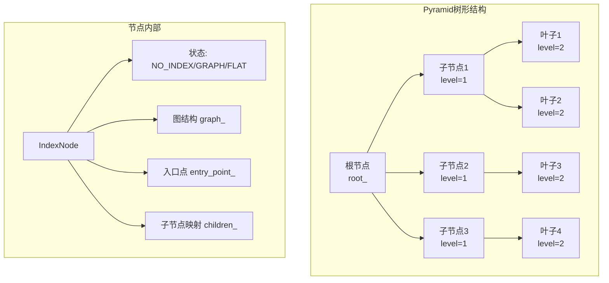
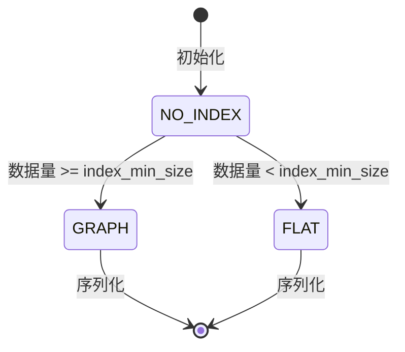
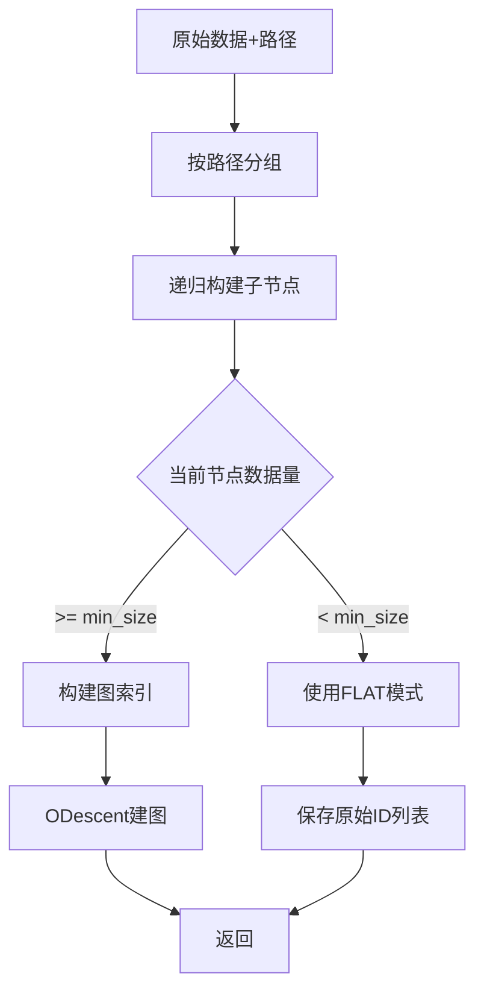
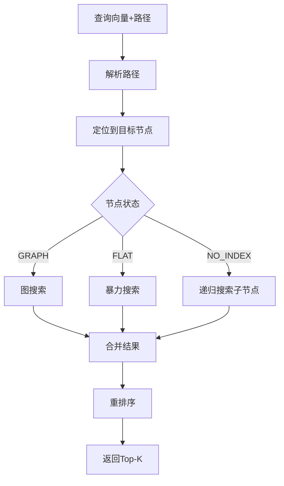

# Pyramid 索引详解

> 创建日期：2026-03-14

## 一句话总结

Pyramid 是一种**分层树形图索引**，通过路径导航和多级子索引结构，将数据按层次组织成金字塔形状，支持基于路径的高效过滤搜索。

---

## 生活比喻：商场导航系统

想象 Pyramid 就像一个**大型购物中心的导航系统**：

- **根节点**：商场总入口，知道所有楼层的信息
- **层级节点**：各楼层、各区域的导购台
- **路径（Path）**：就像"3楼-男装区-运动品牌"这样的导航路径
- **叶子节点**：具体的店铺（向量数据）
- **图结构**：每个区域内的店铺之间的连通关系

```
┌─────────────────────────────────────────────────────────┐
│                  Pyramid 商场导航类比                    │
├─────────────────────────────────────────────────────────┤
│                                                         │
│                      [商场总入口]                        │
│                           │                             │
│           ┌───────────────┼───────────────┐            │
│           ▼               ▼               ▼            │
│      [1楼-女装]      [2楼-男装]      [3楼-餐饮]        │
│           │               │               │            │
│     ┌─────┴─────┐   ┌─────┴─────┐   ┌─────┴─────┐     │
│     ▼           ▼   ▼           ▼   ▼           ▼     │
│ [休闲装]    [正装] [运动]    [商务] [快餐]    [正餐]  │
│     │           │   │           │   │           │     │
│  ┌──┴──┐    ┌──┴┐ ┌┴┐        ┌─┴┐ ┌┴┐       ┌──┴──┐ │
│  ▼     ▼    ▼   ▼ ▼ ▼        ▼  ▼ ▼ ▼       ▼     ▼ │
│ [ZARA][H&M] [...]   [Nike][Adi]  [KFC][McD] [...]   │
│   ↓     ↓            ↓     ↓      ↓     ↓            │
│ 数据点 数据点       数据点 数据点  数据点 数据点       │
│                                                         │
│ 搜索 "2楼-男装-运动" → 快速定位到 [Nike][Adi] 区域      │
│                                                         │
└─────────────────────────────────────────────────────────┘
```

---

## 核心架构

### 1. 整体结构



### 2. 关键组件

| 组件 | 作用 | 类比 |
|------|------|------|
| `root_` | 根节点，搜索入口 | 商场总服务台 |
| `IndexNode` | 索引节点，可包含子节点或图 | 楼层导购台 |
| `base_codes_` | 向量编码存储 | 店铺信息数据库 |
| `odescent_param_` | 图构建参数 | 店铺连通规则 |
| `index_min_size_` | 最小构建大小 | 区域最小店铺数 |

---

## 节点状态机

每个节点有三种状态：



| 状态 | 说明 | 适用场景 |
|------|------|----------|
| `NO_INDEX` | 未构建索引，只有子节点 | 中间层导航节点 |
| `GRAPH` | 已构建图索引 | 数据量大的叶子节点 |
| `FLAT` | 使用暴力搜索 | 数据量小的叶子节点 |

---

## 构建流程

### 1. 分层构建过程



### 2. 代码核心逻辑

```cpp
void IndexNode::Build(ODescent& odescent) {
    std::unique_lock lock(mutex_);
    
    // 1. 初始化当前节点
    if (not ids_.empty()) {
        Init();  // 根据数据量决定是 GRAPH 还是 FLAT
    }
    
    // 2. 如果是图节点，构建图
    if (status_ == Status::GRAPH) {
        entry_point_ = ids_[0];
        odescent.SetMaxDegree(static_cast<int32_t>(graph_param_->max_degree_));
        odescent.Build(ids_);
        odescent.SaveGraph(graph_);
    }
    
    // 3. 递归构建子节点
    for (const auto& item : children_) {
        item.second->Build(odescent);
    }
}

std::vector<int64_t> Pyramid::build_by_odescent(const DatasetPtr& base) {
    // 1. 提取路径信息
    const auto* path = base->GetPaths();
    
    // 2. 存储向量数据
    base_codes_->BatchInsertVector(data_vectors, data_num);
    
    // 3. 使用ODescent构建图
    ODescent graph_builder(odescent_param_, codes, allocator_, thread_pool_.get());
    root_->Build(graph_builder);
    
    return {};
}
```

---

## 搜索流程

### 1. 路径导航搜索



### 2. 代码核心逻辑

```cpp
DatasetPtr Pyramid::search_impl(const DatasetPtr& query,
                                const SearchFunc& search_func,
                                InnerSearchParam& search_param) const {
    DistHeapPtr search_result = std::make_shared<StandardHeap<true, false>>(allocator_, -1);
    
    // 1. 如果有路径，按路径搜索
    if (query_path != nullptr) {
        auto parsed_path = parse_path(current_path);
        
        // 2. 并行搜索多个路径
        for (uint32_t i = 0; i < parsed_path.size(); ++i) {
            IndexNode* node = root_.get();
            
            // 3. 沿路径导航
            for (const auto& item : one_path) {
                node = node->GetChild(item, false);
                if (node == nullptr) break;
            }
            
            // 4. 在目标节点执行搜索
            if (valid) {
                if (thread_pool_ != nullptr && search_param.parallel_search_thread_count > 1) {
                    // 并行搜索
                    futures.push_back(thread_pool_->GeneralEnqueue([&, node]() {
                        node->Search(search_func, vl, search_result_lists[i], search_param.ef);
                    }));
                } else {
                    node->Search(search_func, vl, search_result_lists[i], search_param.ef);
                }
            }
        }
    } else {
        // 5. 无路径时全量搜索
        root_->Search(search_func, vl, search_result, search_param.ef);
    }
    
    // 6. 重排序
    if (use_reorder_) {
        search_result = this->reorder_->Reorder(search_result, query->GetFloat32Vectors(), ...);
    }
    
    return collect_results(search_result);
}
```

---

## 核心参数

| 参数名 | 作用 | 建议值 |
|--------|------|--------|
| `alpha` | 图修剪系数 | 1.0-1.5 |
| `ef_construction` | 构建搜索深度 | 100-400 |
| `max_degree` | 最大邻居数 | 16-64 |
| `index_min_size` | 最小构建大小 | 100-1000 |
| `no_build_levels` | 不建图的层级 | [0]（根层不建图） |

### 自适应参数

Pyramid 会根据数据量自动调整参数：

```cpp
static uint64_t get_suitable_max_degree(int64_t data_num) {
    if (data_num < 100'000) {
        return 16;
    }
    if (data_num < 1000'000) {
        return 32;
    }
    return 64;
}

static uint64_t get_suitable_ef_search(int64_t topk, int64_t data_num, ...) {
    if (data_num < 1'000) {
        return std::max(static_cast<uint64_t>(1.5F * topk), subindex_ef_search);
    }
    if (data_num < 100'000) {
        return std::max(static_cast<uint64_t>(2.0F * topk), subindex_ef_search * 2);
    }
    // ...
}
```

---

## 数据结构可视化

```
┌────────────────────────────────────────────────────────────┐
│                    Pyramid 树形结构                          │
├────────────────────────────────────────────────────────────┤
│                                                            │
│                         ┌─────────┐                        │
│                         │  Root   │                        │
│                         │(NO_INDEX│                        │
│                         │ 导航层) │                        │
│                         └────┬────┘                        │
│              ┌───────────────┼───────────────┐            │
│              ▼               ▼               ▼            │
│         ┌─────────┐    ┌─────────┐    ┌─────────┐        │
│         │ Node_A  │    │ Node_B  │    │ Node_C  │        │
│         │(NO_INDEX│    │(NO_INDEX│    │(GRAPH/  │        │
│         │ 分类层) │    │ 分类层) │    │  FLAT)  │        │
│         └────┬────┘    └────┬────┘    └────┬────┘        │
│       ┌──────┴──────┐       │              │             │
│       ▼             ▼       ▼              ▼             │
│  ┌─────────┐   ┌─────────┐           ┌─────────┐        │
│  │Node_A1  │   │Node_A2  │           │ 数据点  │        │
│  │(GRAPH)  │   │(FLAT)   │           │ 图/列表 │        │
│  └────┬────┘   └────┬────┘           └─────────┘        │
│       │             │                                     │
│       ▼             ▼                                     │
│  ┌─────────┐   ┌─────────┐                               │
│  │ 向量图  │   │ ID列表  │                               │
│  │ 邻居关系│   │ [5,8,12]│                               │
│  └─────────┘   └─────────┘                               │
│                                                            │
└────────────────────────────────────────────────────────────┘
```

---

## 路径格式

路径用于导航到特定子索引，支持多路径搜索：

```cpp
// 单路径
std::string path = "electronics/phones";

// 多路径（用逗号分隔）
std::string multi_path = "electronics/phones,electronics/laptops";

// 路径解析
std::vector<std::string> split(const std::string& str, char delimiter) {
    // 按 '/' 分割路径
    // "electronics/phones" → ["electronics", "phones"]
}
```

---

## 适用场景

| 场景 | 适合度 | 说明 |
|------|--------|------|
| 多租户系统 | ⭐⭐⭐⭐⭐ | 每个租户一个子树，天然隔离 |
| 分类数据 | ⭐⭐⭐⭐⭐ | 按类别路径组织数据 |
| 时间序列 | ⭐⭐⭐⭐ | 按时间路径（年/月/日）组织 |
| 地理位置 | ⭐⭐⭐⭐ | 按地理层级（国家/省/市）组织 |
| 通用稠密向量 | ⭐⭐⭐ | 可用但不如HGraph通用 |

---

## 性能特点

### 优势

1. **路径过滤高效**：通过路径直接定位，避免全量扫描
2. **天然分区**：不同路径的数据物理隔离
3. **并行搜索**：支持多路径并行搜索
4. **自适应构建**：根据数据量自动选择图或FLAT

### 局限

1. **需要路径信息**：必须提供路径才能发挥优势
2. **路径设计重要**：不合理的路径设计会导致倾斜
3. **内存开销**：树形结构有一定额外开销

---

## 代码文件位置

- 头文件：[src/algorithm/pyramid.h](file:///Users/zhuliming/Documents/my_codes/vsag/src/algorithm/pyramid.h)
- 实现：[src/algorithm/pyramid.cpp](file:///Users/zhuliming/Documents/my_codes/vsag/src/algorithm/pyramid.cpp)
- 参数：[src/algorithm/pyramid_zparameters.h](file:///Users/zhuliming/Documents/my_codes/vsag/src/algorithm/pyramid_zparameters.h)
