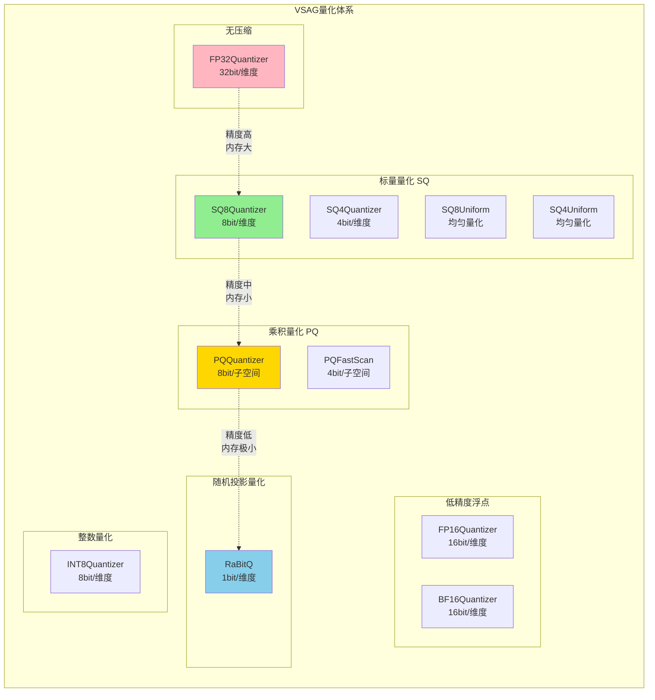
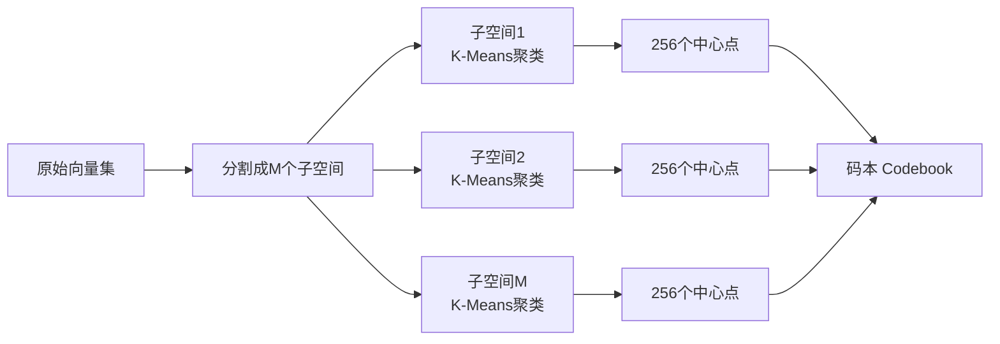
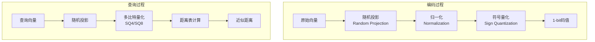
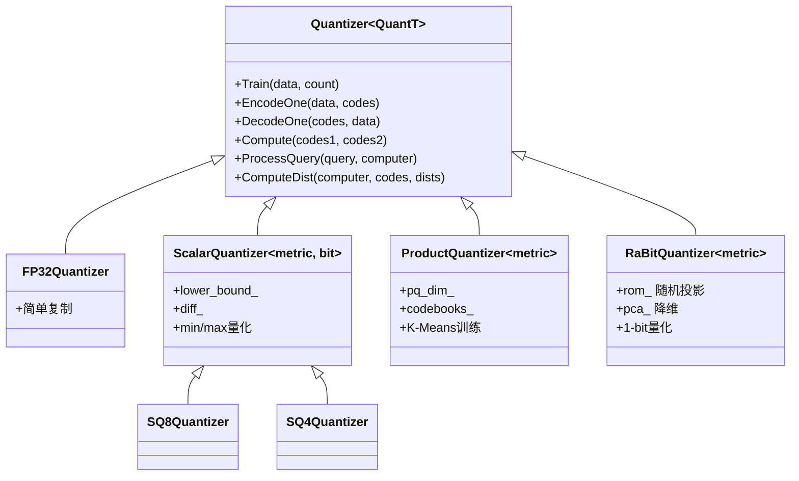

# VSAG 量化算法技术详解

## 一句话总结

量化算法是向量搜索的**"压缩技术"**，通过用更少的比特表示向量数据，在**内存占用、搜索速度和精度之间取得平衡**，让大规模向量搜索变得可行。

---

## 生活比喻：图片压缩

想象你要存储很多高清照片：

- **FP32（原图）**：每张照片50MB，质量最好，但硬盘存不下几张
- **FP16（高质量压缩）**：每张照片25MB，质量几乎无损，省一半空间
- **SQ8（JPEG压缩）**：每张照片6MB，有些质量损失，但省8倍空间
- **PQ（智能压缩）**：把照片分成小块，每块用标准图案代替，省32倍空间
- **RaBitQ（极致压缩）**：只记录关键特征，省64倍以上空间

量化算法就是帮你在"照片质量"和"存储空间"之间做选择。

---

## 量化算法家族图谱



---

## 1. 标量量化 (Scalar Quantization, SQ)

### 1.1 核心思想

把每个维度的浮点数**独立映射**到一个低精度整数：

```
原始值 (float32)          量化值 (uint8)
     ↓                        ↓
[0.0 ~ 255.0]  ──映射──→  [0 ~ 255]
[-1.0 ~ 1.0]   ──映射──→  [0 ~ 255]
```

### 1.2 量化公式

```
量化:   code = round((value - min) / (max - min) * (2^bits - 1))
反量化: value = code * (max - min) / (2^bits - 1) + min
```

### 1.3 SQ8 vs SQ4 对比

```
维度 = 128

┌─────────────────┬─────────────┬─────────────┐
│     类型       │   SQ8       │    SQ4      │
├─────────────────┼─────────────┼─────────────┤
│ 每维度比特     │    8        │     4       │
│ 每向量大小     │  128 bytes  │  64 bytes   │
│ 压缩率         │    4:1      │    8:1      │
│ 精度损失       │    低       │    中       │
│ 适用场景       │  通用场景   │  内存紧张   │
└─────────────────┴─────────────┴─────────────┘
```

### 1.4 代码实现核心

```cpp
template <MetricType metric = MetricType::METRIC_TYPE_L2SQR, int bit = 8>
class ScalarQuantizer : public Quantizer<ScalarQuantizer<metric, bit>> {
    // 训练：计算每个维度的 min/max
    bool TrainImpl(const float* data, uint64_t count) {
        for (uint64_t i = 0; i < count; ++i) {
            for (int d = 0; d < dim_; ++d) {
                lower_bound_[d] = min(lower_bound_[d], data[i * dim_ + d]);
                upper_bound_[d] = max(upper_bound_[d], data[i * dim_ + d]);
            }
        }
        // 计算缩放因子
        for (int d = 0; d < dim_; ++d) {
            diff_[d] = upper_bound_[d] - lower_bound_[d];
        }
    }
    
    // 编码：float -> int
    bool EncodeOneImpl(const float* data, uint8_t* codes) const {
        for (int d = 0; d < dim_; ++d) {
            float normalized = (data[d] - lower_bound_[d]) / diff_[d];
            codes[d] = static_cast<uint8_t>(normalized * ((1 << bit) - 1));
        }
    }
    
    // 解码：int -> float
    bool DecodeOneImpl(const uint8_t* codes, float* data) {
        for (int d = 0; d < dim_; ++d) {
            data[d] = codes[d] * diff_[d] / ((1 << bit) - 1) + lower_bound_[d];
        }
    }
};
```

---

## 2. 乘积量化 (Product Quantization, PQ)

### 2.1 核心思想

把高维向量**分割成子空间**，每个子空间独立训练码本：

```
原始向量 (128维)                    PQ量化后
     ↓                                  ↓
┌─────────────────────────┐      ┌──────────────┐
│ d0  d1  d2 ... d127     │      │ c0  c1  c2   │
│ [====M个子空间====]      │  →   │ [M个码值]    │
│ 每段16维，共8段          │      │ 每段1字节    │
└─────────────────────────┘      └──────────────┘
        512 bytes                      8 bytes
```

### 2.2 码本训练过程



### 2.3 距离计算优化

PQ的核心优势是**查询时预计算距离表**：

```cpp
// 1. 查询时：预计算查询向量到所有中心点的距离
void ProcessQueryImpl(const DataType* query, Computer<PQQuantizer>& computer) const {
    for (int64_t m = 0; m < pq_dim_; ++m) {
        const float* sub_query = query + m * subspace_dim_;
        float* table = computer.buf_ + m * 256;  // 距离表
        
        for (int j = 0; j < 256; ++j) {
            const float* centroid = codebooks_[m][j];
            table[j] = compute_distance(sub_query, centroid, subspace_dim_);
        }
    }
}

// 2. 计算距离时：直接查表累加
void ComputeDistImpl(Computer<PQQuantizer>& computer, const uint8_t* codes, float* dists) const {
    float dist = 0;
    for (int64_t m = 0; m < pq_dim_; ++m) {
        dist += computer.buf_[m * 256 + codes[m]];  // 查表
    }
    *dists = dist;
}
```

### 2.4 PQ vs PQFastScan

```
┌─────────────────┬─────────────┬─────────────────┐
│     特性        │     PQ      │   PQFastScan    │
├─────────────────┼─────────────┼─────────────────┤
│ 子空间码值     │   8 bit     │     4 bit       │
│ 每子空间中心点  │    256      │      16         │
│ 压缩率         │    64:1     │    128:1        │
│ 计算优化       │  查表累加   │  SIMD批量处理   │
│ 适用场景       │  平衡场景   │  极致速度场景   │
└─────────────────┴─────────────┴─────────────────┘
```

---

## 3. RaBitQ 量化

### 3.1 核心思想

RaBitQ (Randomized Binary Quantization) 是一种**基于随机投影的1-bit量化**：

```
原始向量                    RaBitQ量化
     ↓                           ↓
[0.1, -0.5, 0.8, ...]     [1, 0, 1, ...]
  32bit x 128 = 512B        1bit x 128 = 16B
```

### 3.2 算法流程



### 3.3 关键技术点

```cpp
template <MetricType metric>
class RaBitQuantizer : public Quantizer<RaBitQuantizer<metric>> {
    // 1. 随机投影矩阵
    std::shared_ptr<VectorTransformer> rom_;  // Random Orthogonal Matrix
    
    // 2. 查询量化比特数
    uint64_t num_bits_per_dim_query_;  // 通常4或32
    
    // 3. 基础量化比特数  
    uint32_t num_bits_per_dim_base_;   // 通常1
    
    // 编码流程
    bool EncodeOneImpl(const DataType* data, uint8_t* codes) {
        // 1. PCA降维
        pca_->Transform(data, pca_data.data());
        
        // 2. 随机投影
        rom_->Transform(pca_data.data(), transformed_data.data());
        
        // 3. 归一化
        float norm = NormalizeWithCentroid(transformed_data.data(), ...);
        
        // 4. 1-bit量化（只保留符号）
        EncodeExtendRaBitQ(normed_data.data(), codes, y_norm);
    }
};
```

### 3.4 位重排优化

```cpp
// 原始存储：每个维度的所有比特连续存储
// [d0_b0, d0_b1, d0_b2, d0_b3] [d1_b0, d1_b1, d1_b2, d1_b3] ...

// 重排后：相同位置的比特连续存储（便于SIMD）
// [d0_b0, d1_b0, d2_b0, ...] [d0_b1, d1_b1, d2_b1, ...] ...

void ReOrderSQ4(const uint8_t* input, uint8_t* output) const {
    for (uint64_t d = 0; d < dim_; ++d) {
        for (uint64_t bit_pos = 0; bit_pos < num_bits_per_dim_query_; ++bit_pos) {
            // 提取第d个维度的第bit_pos位
            uint8_t bit_value = (input[d / 2] >> ((d % 2) * 4 + bit_pos)) & 0x1;
            
            // 放到重排后的位置
            uint64_t output_bit_pos = bit_pos * aligned_dim_ + d;
            output[output_bit_pos / 8] |= (bit_value << (output_bit_pos % 8));
        }
    }
}
```

---

## 4. 低精度浮点量化

### 4.1 FP16 (半精度浮点)

```
FP32: 1位符号 + 8位指数 + 23位尾数 = 32位
FP16: 1位符号 + 5位指数 + 10位尾数 = 16位

压缩率: 2:1
精度损失: 较小（适合多数场景）
```

### 4.2 BF16 (Brain Float16)

```
BF16: 1位符号 + 8位指数 + 7位尾数 = 16位

特点：
- 与FP32相同的指数范围（不易溢出）
- 尾数比FP16少3位
- 深度学习场景常用
```

### 4.3 代码实现

```cpp
class FP16Quantizer : public Quantizer<FP16Quantizer<metric>> {
    bool EncodeOneImpl(const DataType* data, uint8_t* codes) const {
        for (int i = 0; i < dim_; ++i) {
            // float32 -> float16
            ((uint16_t*)codes)[i] = float32_to_float16(data[i]);
        }
    }
    
    bool DecodeOneImpl(const uint8_t* codes, DataType* data) {
        for (int i = 0; i < dim_; ++i) {
            // float16 -> float32
            data[i] = float16_to_float32(((uint16_t*)codes)[i]);
        }
    }
};
```

---

## 5. 量化算法对比总结

```
┌────────────────┬──────────┬──────────┬──────────┬────────────┬─────────────┐
│    算法        │ 压缩率   │ 精度损失 │ 计算速度 │  内存占用   │   适用场景   │
├────────────────┼──────────┼──────────┼──────────┼────────────┼─────────────┤
│ FP32           │   1:1    │   无     │   快     │    高      │  精度优先    │
│ FP16/BF16      │   2:1    │   极低   │   快     │   中高     │  通用场景    │
│ INT8           │   4:1    │   低     │   快     │   中       │  模型量化    │
│ SQ8            │   4:1    │   低     │   快     │   中       │  通用压缩    │
│ SQ4            │   8:1    │   中     │   快     │   低       │  内存紧张    │
│ PQ (M=8)       │  64:1    │   中     │   很快   │   极低     │  大规模数据  │
│ PQFastScan     │ 128:1    │   中高   │   极快   │   极低     │  极速场景    │
│ RaBitQ         │ 256:1+   │   高     │   很快   │   极低     │  超大规模    │
└────────────────┴──────────┴──────────┴──────────┴────────────┴─────────────┘
```

---

## 6. Computer 机制详解

### 6.1 为什么需要 Computer？

查询时需要**预计算一些中间结果**（如PQ的距离表），这些结果需要缓存：

```cpp
template <typename T>
class Computer : public ComputerInterface {
public:
    // 设置查询向量，触发预计算
    void SetQuery(const DataType* query) {
        quantizer_->ProcessQuery(query, *this);
    }
    
    // 计算与单个编码向量的距离
    inline void ComputeDist(const uint8_t* codes, float* dists) {
        quantizer_->ComputeDist(*this, codes, dists);
    }
    
    // 批量计算距离（SIMD优化）
    inline void ScanBatchDists(uint64_t count, const uint8_t* codes, float* dists) {
        quantizer_->ScanBatchDists(*this, count, codes, dists);
    }
    
public:
    uint8_t* buf_;  // 预计算结果缓存（如距离表）
    Vector<float> raw_query_;  // 原始查询向量
};
```

### 6.2 使用流程

```cpp
// 1. 创建量化器
auto quantizer = std::make_shared<SQ8Quantizer<...>>(dim, allocator);
quantizer->Train(data, count);

// 2. 编码向量
quantizer->EncodeOne(vector, code);

// 3. 创建Computer并查询
auto computer = quantizer->FactoryComputer();
computer->SetQuery(query);  // 预计算

// 4. 计算距离
float dist;
computer->ComputeDist(code, &dist);
```

---

## 7. 量化器继承体系



---

## 8. 要点回顾

1. **量化的本质**：用更少比特表示数据，牺牲一定精度换取内存和速度
2. **SQ适合通用场景**：实现简单，压缩率适中，精度损失可控
3. **PQ适合大规模数据**：通过子空间分解实现高压缩率，查询时只需查表
4. **RaBitQ适合超大规模**：极致压缩，适合内存极其有限的场景
5. **Computer机制**：缓存查询相关的预计算结果，加速距离计算
6. **选择原则**：根据数据规模、内存限制、精度要求综合选择
