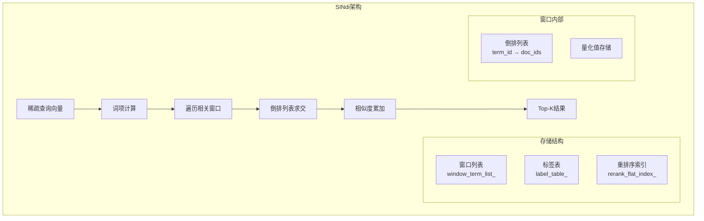
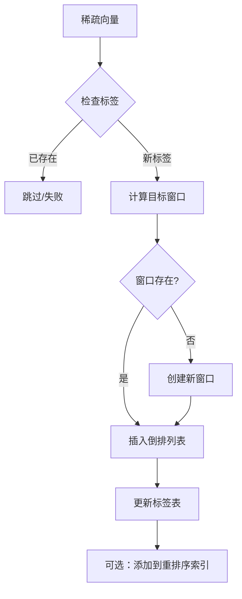
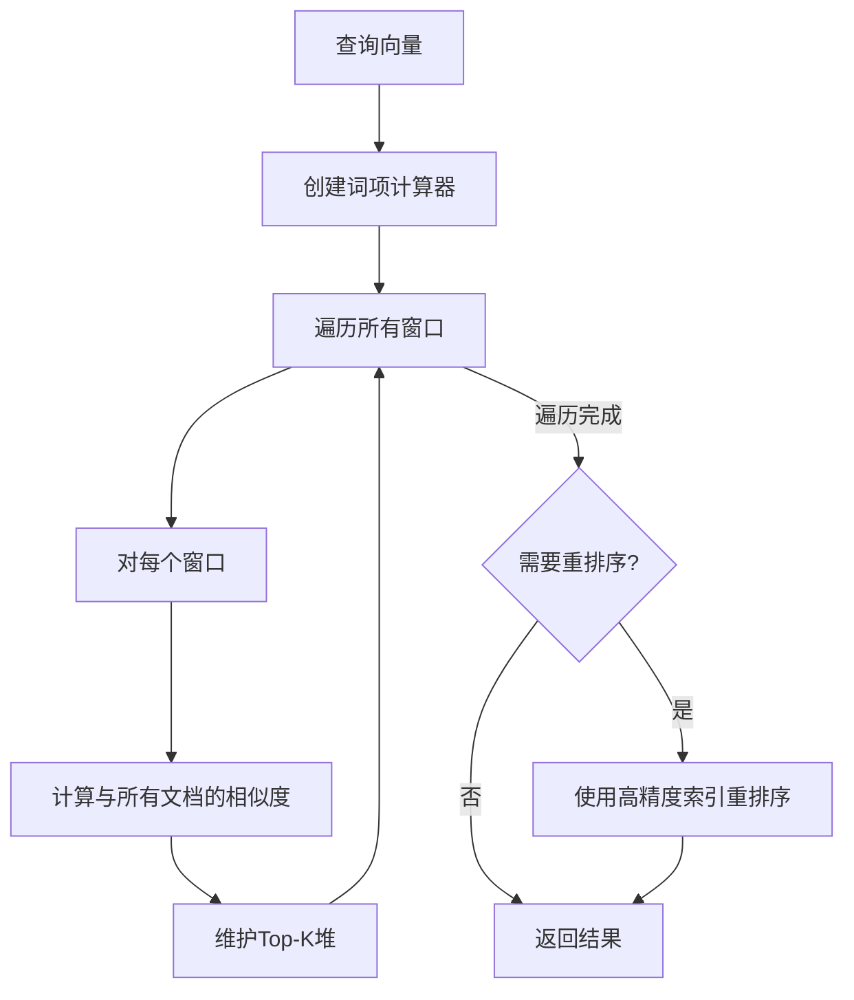
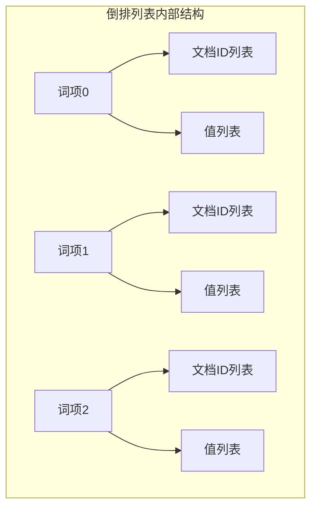

# SINdi 索引详解

> 创建日期：2026-03-14

## 一句话总结

SINdi（Sparse Index with Non-zero Dimension Indexing）是一种**稀疏向量索引**，专为高维稀疏数据设计，通过分窗口存储和倒排列表结构，实现高效的稀疏向量相似度搜索。

---

## 生活比喻：图书馆分类系统

想象 SINdi 就像一个**大型图书馆的分类检索系统**：

- **稀疏向量**：就像一本书只在少数几个主题上有内容（大部分章节是空的）
- **词项（Term）**：就像图书的主题标签
- **窗口（Window）**：就像图书馆的分馆，每馆管理一批书籍
- **倒排列表**：就像主题索引卡片，记录每个主题有哪些书
- **量化压缩**：就像用简写代替完整主题描述，节省空间

```
┌─────────────────────────────────────────────────────────┐
│                    SINdi 图书馆类比                      │
├─────────────────────────────────────────────────────────┤
│                                                         │
│   分馆1（窗口0）      分馆2（窗口1）      分馆3（窗口2）   │
│   ┌─────────┐        ┌─────────┐        ┌─────────┐    │
│   │ 书0-99  │        │书100-199│        │书200-299│    │
│   │         │        │         │        │         │    │
│   │ 数学: 5 │        │ 物理: 8 │        │ 化学: 3 │    │
│   │ 物理: 2 │        │ 化学: 5 │        │ 生物: 7 │    │
│   │ 英语: 7 │        │ 数学: 3 │        │ 数学: 2 │    │
│   └─────────┘        └─────────┘        └─────────┘    │
│                                                         │
│   主题索引（倒排列表）                                    │
│   数学 → [书0(5), 书102(3), 书200(2)]                   │
│   物理 → [书1(2), 书100(8)]                             │
│   化学 → [书101(5), 书201(3)]                           │
│                                                         │
└─────────────────────────────────────────────────────────┘
```

---

## 核心架构

### 1. 整体结构



### 2. 关键组件

| 组件 | 作用 | 类比 |
|------|------|------|
| `window_term_list_` | 分窗口存储稀疏向量 | 图书馆分馆 |
| `term_id_limit_` | 最大词项ID限制 | 主题分类总数 |
| `window_size_` | 每个窗口的向量数 | 每个分馆藏书量 |
| `doc_retain_ratio_` | 文档保留比例 | 索引覆盖率 |
| `rerank_flat_index_` | 高精度重排序 | 详细档案室 |

---

## 稀疏向量表示

### 数据结构

```cpp
struct SparseVector {
    int32_t len_;           // 非零元素个数
    int32_t* ids_;          // 非零维度索引（词项ID）
    float* vals_;           // 对应维度的值
};
```

### 可视化示例

```
稠密向量（10000维）                    稀疏向量表示
┌─────────────────┐                   ┌─────────────────┐
│ [0, 0, 0, ...   │                   │ len_ = 3        │
│  0, 5, 0, ...   │   ────────→       │ ids_ = [4, 7, 9]│
│  0, 0, 0, ...   │    压缩            │ vals_= [5,3,8]  │
│  3, 0, 8, ...]  │                   └─────────────────┘
└─────────────────┘
      ↓                                    ↓
  10000个浮点数                      仅需3个索引+3个值
  = 40KB（FP32）                     ≈ 24字节
```

---

## 构建流程

### 1. 添加向量（Add）



### 2. 代码核心逻辑

```cpp
std::vector<int64_t> SINDI::Add(const DatasetPtr& base, AddMode mode) {
    // 1. 动态调整窗口数量
    int64_t final_add_window = align_up(cur_element_count_ + data_num, window_size_) / window_size_;
    while (window_term_list_.size() < final_add_window) {
        window_term_list_.emplace_back(
            std::make_shared<SparseTermDataCell>(doc_retain_ratio_, term_id_limit_, ...)
        );
    }
    
    // 2. 逐个处理向量
    for (uint32_t i = 0; i < data_num; ++i) {
        auto cur_window = cur_element_count_ / window_size_;
        auto inner_id = static_cast<uint16_t>(cur_element_count_ - cur_window * window_size_);
        
        // 3. 插入到对应窗口的倒排列表
        window_term_list_[cur_window]->InsertVector(sparse_vector, inner_id);
        
        // 4. 更新标签映射
        label_table_->Insert(cur_element_count_, ids[i]);
        
        cur_element_count_++;
    }
}
```

---

## 搜索流程

### 1. 相似度计算原理

稀疏向量的相似度通常使用 **点积（Dot Product）** 或 **余弦相似度**：

```
Query:  [0, 0, 3, 0, 5, 0, 2]  →  {(2,3), (4,5), (6,2)}
Doc:    [1, 0, 3, 0, 0, 0, 2]  →  {(0,1), (2,3), (6,2)}

相似度 = 3*3 + 2*2 = 9 + 4 = 13
（只在共同非零维度上计算）
```

### 2. 搜索算法



### 3. 代码核心逻辑

```cpp
template <InnerSearchMode mode>
DatasetPtr SINDI::search_impl(const SparseTermComputerPtr& computer,
                              const InnerSearchParam& inner_param,
                              Allocator* allocator,
                              bool use_term_lists_heap_insert) const {
    MaxHeap heap(allocator);
    Vector<float> dists(window_size_, 0.0, allocator);
    
    // 1. 遍历所有窗口
    for (auto cur = min_window_id; cur <= max_window_id; cur++) {
        auto window_start_id = cur * window_size_;
        auto term_list = this->window_term_list_[cur];
        
        // 2. 计算相似度
        term_list->Query(dists.data(), computer);
        
        // 3. 将结果加入堆
        term_list->InsertHeapByDists<mode>(dists.data(), dists.size(), heap, ...);
    }
    
    // 4. 重排序（如果需要）
    if (use_reorder_) {
        return rerank_by_high_precision(heap);
    }
    
    return collect_results(heap);
}
```

---

## 核心参数

| 参数名 | 作用 | 建议值 |
|--------|------|--------|
| `term_id_limit` | 最大词项ID | 根据数据确定 |
| `window_size` | 每窗口向量数 | 10000-100000 |
| `doc_prune_ratio` | 文档剪枝比例 | 0.1-0.3 |
| `use_reorder` | 是否重排序 | true（精度优先） |
| `use_quantization` | 是否量化 | true（内存优先） |
| `n_candidate` | 候选集大小 | 10*k |

---

## 倒排列表结构



### 内存布局

```
┌────────────────────────────────────────────────────────────┐
│                    SparseTermDataCell                        │
├────────────────────────────────────────────────────────────┤
│  ┌─────────────────┐                                       │
│  │   倒排列表数组   │                                       │
│  │  ┌───────────┐  │                                       │
│  │  │ term_id=0 │──┼──→ [doc_5, doc_12, doc_23, ...]       │
│  │  │ term_id=1 │──┼──→ [doc_3, doc_8, doc_15, ...]        │
│  │  │ term_id=2 │──┼──→ [doc_1, doc_7, doc_19, ...]        │
│  │  │    ...    │  │                                       │
│  │  └───────────┘  │                                       │
│  └─────────────────┘                                       │
│  ┌─────────────────┐                                       │
│  │   量化参数       │  min_val, max_val, diff               │
│  └─────────────────┘                                       │
└────────────────────────────────────────────────────────────┘
```

---

## 量化压缩

### 量化过程

```cpp
// 将浮点值量化到8位整数
uint8_t quantize(float val) {
    float normalized = (val - min_val) / diff;  // 归一化到[0,1]
    return static_cast<uint8_t>(normalized * 255);  // 映射到[0,255]
}

// 反量化
float dequantize(uint8_t qval) {
    return min_val + (qval / 255.0f) * diff;
}
```

### 内存节省

| 存储方式 | 每个非零值大小 | 压缩比 |
|----------|----------------|--------|
| FP32 | 4字节 | 1x |
| FP16 | 2字节 | 2x |
| 8-bit 量化 | 1字节 | 4x |

---

## 适用场景

| 场景 | 适合度 | 说明 |
|------|--------|------|
| 文本embedding | ⭐⭐⭐⭐⭐ | 文本天然稀疏，如TF-IDF、BM25 |
| 推荐系统 | ⭐⭐⭐⭐ | 用户-物品交互矩阵稀疏 |
| 基因数据 | ⭐⭐⭐⭐ | 基因表达数据稀疏 |
| 稠密向量 | ⭐ | 不适合，请用HGraph/HNSW |
| 实时更新 | ⭐⭐⭐ | 支持增量添加，窗口扩展有开销 |

---

## 性能特点

### 优势

1. **内存高效**：只存储非零元素，通常节省90%+空间
2. **计算高效**：相似度计算只需遍历共同非零维度
3. **天然可剪枝**：低频词项可安全剪枝

### 局限

1. **不适合稠密数据**：稠密向量会导致倒排列表过长
2. **窗口管理开销**：动态扩展窗口需要重新分配内存
3. **过滤支持有限**：当前版本过滤功能较弱

---

## 代码文件位置

- 头文件：[src/algorithm/sindi/sindi.h](file:///Users/zhuliming/Documents/my_codes/vsag/src/algorithm/sindi/sindi.h)
- 实现：[src/algorithm/sindi/sindi.cpp](file:///Users/zhuliming/Documents/my_codes/vsag/src/algorithm/sindi/sindi.cpp)
- 参数：[src/algorithm/sindi/sindi_parameter.h](file:///Users/zhuliming/Documents/my_codes/vsag/src/algorithm/sindi/sindi_parameter.h)
