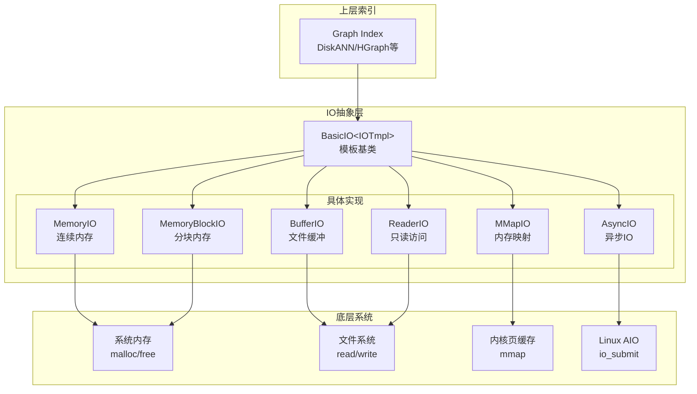
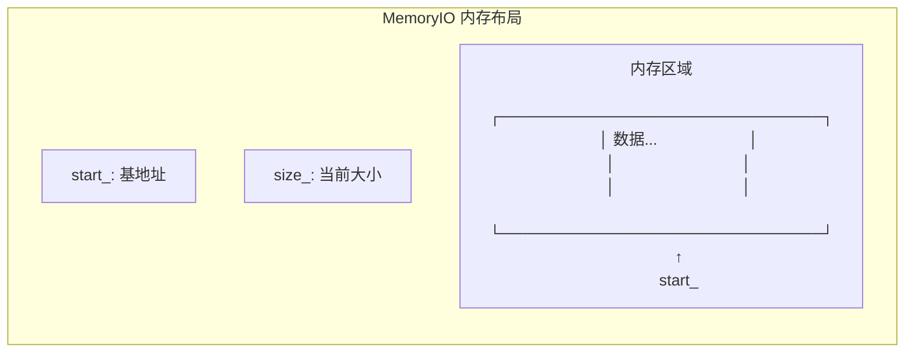
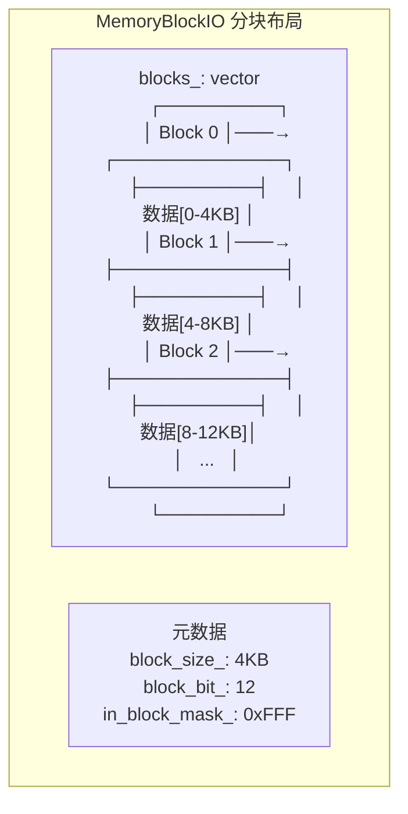
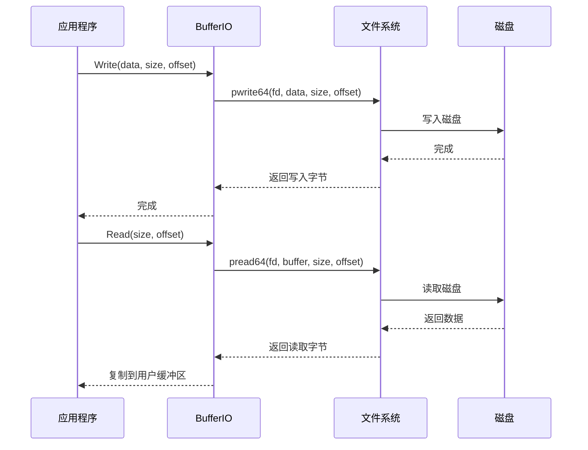
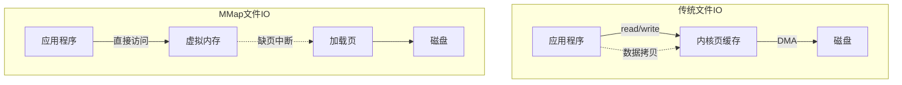
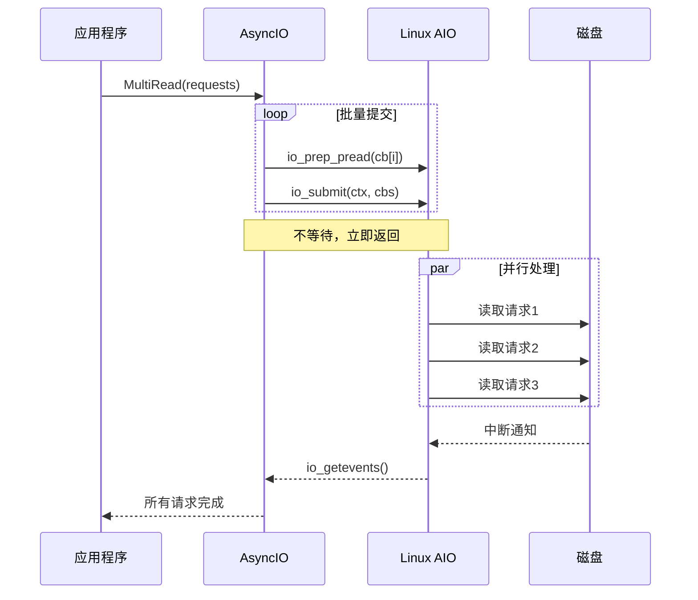
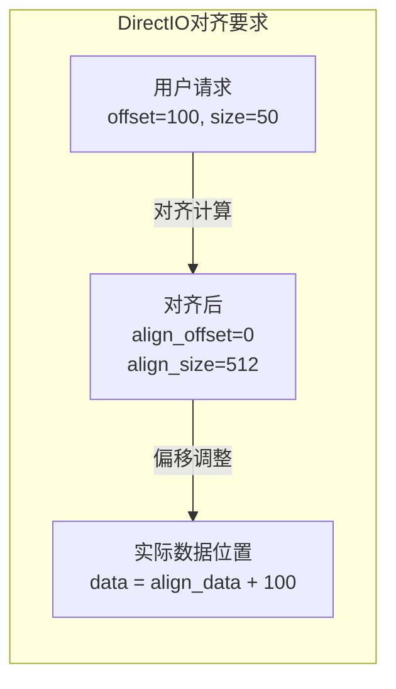
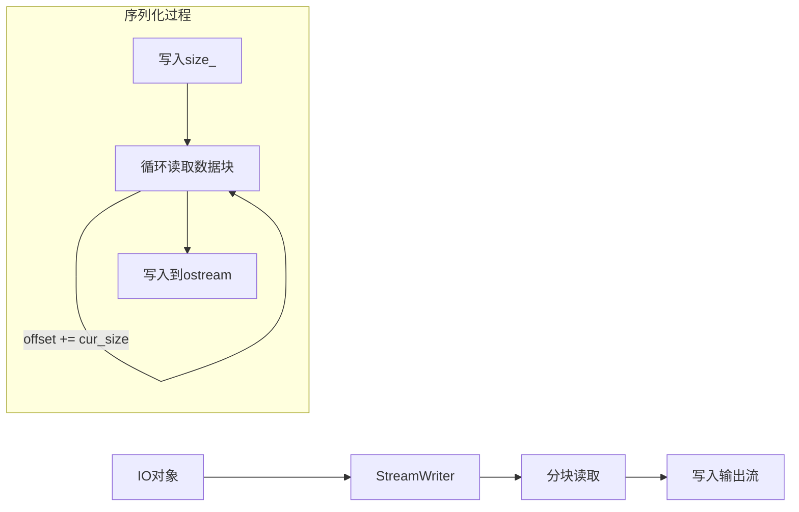

# VSAG 存储系统技术详解

## 一句话总结

VSAG的存储系统是一个**多层次的IO抽象层**，通过统一的接口封装了**内存、磁盘、异步IO、内存映射**等多种存储方式，让上层索引可以透明地选择最适合的存储策略。

---

## 生活比喻：不同的储物方式

想象你要存放物品，有不同的选择：

- **MemoryIO**：放在手边桌面上——最快，但空间有限
- **MemoryBlockIO**：放在带抽屉的柜子里——分块管理，扩展方便
- **BufferIO**：放在仓库的货架上——持久化，需要时去取
- **MMapIO**：在仓库和桌面之间建立传送带——按需自动搬运
- **AsyncIO**：雇佣多个搬运工并行取货——批量异步，效率最高

VSAG的存储系统就是让你根据物品特点选择最合适的存放方式。

---

## 整体架构



---

## 1. BasicIO 模板基类

### 1.1 核心设计

使用**CRTP (Curiously Recurring Template Pattern)** 实现编译期多态：

```cpp
template <typename IOTmpl>
class BasicIO {
public:
    static constexpr bool InMemory = IOTmpl::InMemory;
    static constexpr bool SkipDeserialize = IOTmpl::SkipDeserialize;

    // 写入数据
    inline void Write(const uint8_t* data, uint64_t size, uint64_t offset) {
        static_assert(has_WriteImpl<IOTmpl>::value);
        cast().WriteImpl(data, size, offset);
    }

    // 读取数据
    inline bool Read(uint64_t size, uint64_t offset, uint8_t* data) const {
        static_assert(has_ReadImpl<IOTmpl>::value);
        return cast().ReadImpl(size, offset, data);
    }

    // 直接读取（零拷贝）
    inline const uint8_t* Read(uint64_t size, uint64_t offset, bool& need_release) const {
        return cast().DirectReadImpl(size, offset, need_release);
    }

    // 批量读取
    inline bool MultiRead(uint8_t* datas, uint64_t* sizes, uint64_t* offsets, uint64_t count) {
        return cast().MultiReadImpl(datas, sizes, offsets, count);
    }

    // 预取数据
    inline void Prefetch(uint64_t offset, uint64_t cache_line = 64) {
        if constexpr (has_PrefetchImpl<IOTmpl>::value) {
            return cast().PrefetchImpl(offset, cache_line);
        }
    }

private:
    // CRTP: 获取派生类实例
    inline IOTmpl& cast() {
        return static_cast<IOTmpl&>(*this);
    }
};
```

### 1.2 设计优势

```
传统虚函数多态：
  调用 Write() → 查虚表 → 调用实际实现
  
CRTP编译期多态：
  调用 Write() → 编译器直接内联实际实现
  
优势：
  ✓ 无运行时开销
  ✓ 支持编译期优化（内联、循环展开）
  ✓ 类型安全，错误在编译期发现
```

---

## 2. 内存存储实现

### 2.1 MemoryIO - 连续内存



```cpp
class MemoryIO : public BasicIO<MemoryIO> {
public:
    static constexpr bool InMemory = true;
    
    explicit MemoryIO(Allocator* allocator) : BasicIO<MemoryIO>(allocator) {
        start_ = static_cast<uint8_t*>(allocator->Allocate(1));
    }

    void WriteImpl(const uint8_t* data, uint64_t size, uint64_t offset) {
        check_and_realloc(size + offset);
        memcpy(start_ + offset, data, size);
    }

    bool ReadImpl(uint64_t size, uint64_t offset, uint8_t* data) const {
        memcpy(data, start_ + offset, size);
        return true;
    }

    const uint8_t* DirectReadImpl(uint64_t size, uint64_t offset, bool& need_release) const {
        need_release = false;  // 零拷贝，无需释放
        return start_ + offset;
    }

private:
    uint8_t* start_{nullptr};
};
```

### 2.2 MemoryBlockIO - 分块内存



**为什么需要分块？**

```
连续内存的问题：
  - 扩容时需要重新分配大块内存
  - 可能导致内存碎片
  - 大内存分配容易失败

分块内存的优势：
  - 按需分配小块
  - 扩容只需添加新块
  - 更好的内存局部性
```

```cpp
class MemoryBlockIO : public BasicIO<MemoryBlockIO> {
public:
    static constexpr bool InMemory = true;

    void WriteImpl(const uint8_t* data, uint64_t size, uint64_t offset) {
        check_and_realloc(size + offset);
        
        auto start_no = offset >> block_bit_;      // 块号
        auto start_off = offset & in_block_mask_;  // 块内偏移
        
        while (cur_size < size) {
            uint8_t* cur_write = blocks_[start_no] + start_off;
            auto cur_length = std::min(size - cur_size, block_size_ - start_off);
            memcpy(cur_write, data + cur_size, cur_length);
            cur_size += cur_length;
            ++start_no;
            start_off = 0;
        }
    }

private:
    Vector<uint8_t*> blocks_;      // 块指针数组
    uint64_t block_size_;          // 块大小（2的幂）
    uint64_t block_bit_;           // 块大小对应的位数
    uint64_t in_block_mask_;       // 块内偏移掩码
};
```

---

## 3. 文件存储实现

### 3.1 BufferIO - 标准文件IO



```cpp
class BufferIO : public BasicIO<BufferIO> {
public:
    static constexpr bool InMemory = false;

    BufferIO(std::string filename, Allocator* allocator) 
        : BasicIO<BufferIO>(allocator), filepath_(std::move(filename)) {
        // 打开文件
        this->fd_ = open(filepath_.c_str(), O_CREAT | O_RDWR, 0644);
    }

    void WriteImpl(const uint8_t* data, uint64_t size, uint64_t offset) {
        // 使用pwrite保证线程安全
        auto ret = pwrite64(this->fd_, data, size, static_cast<int64_t>(offset));
        if (ret != size) {
            throw VsagException(ErrorType::INTERNAL_ERROR, "write failed");
        }
    }

    bool ReadImpl(uint64_t size, uint64_t offset, uint8_t* data) const {
        auto ret = pread64(this->fd_, data, size, static_cast<int64_t>(offset));
        return ret == size;
    }

private:
    std::string filepath_;
    int fd_{-1};  // 文件描述符
};
```

### 3.2 MMapIO - 内存映射文件



**MMap的优势：**

```
1. 零拷贝：用户空间直接访问内核页缓存
2. 按需加载：只加载实际访问的页
3. 内核管理：利用内核的页缓存和预读策略
4. 进程共享：多个进程可以映射同一文件
```

```cpp
class MMapIO : public BasicIO<MMapIO> {
public:
    static constexpr bool InMemory = false;

    MMapIO(std::string filename, Allocator* allocator) {
        // 1. 打开文件
        this->fd_ = open(filepath_.c_str(), O_CREAT | O_RDWR, 0644);
        
        // 2. 设置文件大小
        ftruncate64(this->fd_, mmap_size);
        
        // 3. 建立内存映射
        void* addr = mmap(nullptr, mmap_size, PROT_READ | PROT_WRITE, MAP_SHARED, this->fd_, 0);
        this->start_ = static_cast<uint8_t*>(addr);
    }

    ~MMapIO() {
        munmap(this->start_, this->size_);  // 解除映射
        close(this->fd_);
    }

    void WriteImpl(const uint8_t* data, uint64_t size, uint64_t offset) {
        // 直接内存拷贝，无系统调用
        memcpy(start_ + offset, data, size);
        
        // 可选：msync强制刷盘
        // msync(start_ + offset, size, MS_SYNC);
    }

    bool ReadImpl(uint64_t size, uint64_t offset, uint8_t* data) const {
        memcpy(data, start_ + offset, size);
        return true;
    }

    const uint8_t* DirectReadImpl(uint64_t size, uint64_t offset, bool& need_release) const {
        need_release = false;
        return start_ + offset;  // 真正的零拷贝
    }

private:
    uint8_t* start_{nullptr};  // 映射的起始地址
    int fd_{-1};
};
```

---

## 4. 异步IO实现

### 4.1 AsyncIO - Linux原生异步IO



### 4.2 IO上下文池

```cpp
// IO上下文池，避免频繁创建/销毁
class IOContext : public ResourceObject {
public:
    static constexpr int64_t DEFAULT_REQUEST_COUNT = 100;

    IOContext() {
        // 初始化AIO上下文
        io_setup(DEFAULT_REQUEST_COUNT, &this->ctx_);
        
        // 预分配控制块
        for (int i = 0; i < DEFAULT_REQUEST_COUNT; ++i) {
            this->cb_[i] = static_cast<iocb*>(malloc(sizeof(struct iocb)));
        }
    }

    ~IOContext() override {
        io_destroy(this->ctx_);
        for (int i = 0; i < DEFAULT_REQUEST_COUNT; ++i) {
            free(this->cb_[i]);
        }
    }

public:
    io_context_t ctx_;                          // AIO上下文
    struct iocb* cb_[DEFAULT_REQUEST_COUNT];    // 控制块数组
    struct io_event events_[DEFAULT_REQUEST_COUNT];  // 事件数组
};

using IOContextPool = ResourceObjectPool<IOContext>;

// 全局IO上下文池
std::unique_ptr<IOContextPool> AsyncIO::io_context_pool = 
    std::make_unique<IOContextPool>(10, nullptr);
```

### 4.3 DirectIO 对齐要求



```cpp
class DirectIOObject {
public:
    void Set(uint64_t size1, uint64_t offset1) {
        // 对齐要求：
        // 1. 偏移必须是align_size的倍数
        // 2. 大小必须是align_size的倍数
        
        auto new_offset = (offset >> align_bit) << align_bit;  // 向下对齐
        auto inner_offset = offset & align_mask;                // 块内偏移
        auto new_size = (((size + inner_offset) + align_mask) >> align_bit) << align_bit;
        
        // 分配对齐的内存
        this->align_data = static_cast<uint8_t*>(
            std::aligned_alloc(align_size, new_size)
        );
        
        // 实际数据位置
        this->data = align_data + inner_offset;
        this->size = new_size;
        this->offset = new_offset;
    }

public:
    uint8_t* data{nullptr};        // 用户可见的数据指针
    uint8_t* align_data{nullptr};  // 对齐后的实际内存
    uint64_t size;
    uint64_t offset;
    
    int64_t align_bit = 9;    // 512字节对齐
    int64_t align_size = 512;
    int64_t align_mask = 511;
};
```

---

## 5. ReaderIO - 只读访问

### 5.1 设计目的

```
场景：索引已经序列化到外部存储（如S3、HDFS），
      需要通过Reader接口访问，不需要写操作。

优势：
  - 无需本地磁盘空间
  - 可以直接读取远程存储
  - 支持分片读取
```

```cpp
class ReaderIO : public BasicIO<ReaderIO> {
public:
    static constexpr bool InMemory = false;
    static constexpr bool SkipDeserialize = true;  // 反序列化时跳过数据拷贝

    bool ReadImpl(uint64_t size, uint64_t offset, uint8_t* data) const {
        // 通过Reader接口读取
        reader_->Read(offset, size, data);
        return true;
    }

    const uint8_t* DirectReadImpl(uint64_t size, uint64_t offset, bool& need_release) const {
        // 某些Reader支持零拷贝
        return reader_->GetDataPtr(offset, size);
    }

private:
    std::shared_ptr<Reader> reader_;
};
```

---

## 6. IO类型对比

```
┌────────────────┬──────────┬──────────┬──────────┬────────────┬─────────────────┐
│     类型       │ 存储位置 │  持久化  │  扩容    │   访问延迟  │     适用场景     │
├────────────────┼──────────┼──────────┼──────────┼────────────┼─────────────────┤
│ MemoryIO       │   内存   │   否     │ 重新分配 │    极低     │  小数据，极速    │
│ MemoryBlockIO  │   内存   │   否     │ 动态添加 │    极低     │  大数据，内存中  │
│ BufferIO       │   磁盘   │   是     │ 文件扩展 │    中等     │  通用文件存储    │
│ MMapIO         │ 内存+磁盘│   是     │ 重新映射 │    低       │  大文件随机访问  │
│ AsyncIO        │   磁盘   │   是     │ 文件扩展 │    中等     │  批量并行读取    │
│ ReaderIO       │  外部    │   是     │  只读    │  取决于实现  │  远程/云存储     │
└────────────────┴──────────┴──────────┴──────────┴────────────┴─────────────────┘
```

---

## 7. 序列化与反序列化

### 7.1 序列化流程



```cpp
inline void Serialize(StreamWriter& writer) {
    // 1. 写入大小
    StreamWriter::WriteObj(writer, this->size_);
    
    // 2. 分块读取并写入
    ByteBuffer buffer(SERIALIZE_BUFFER_SIZE, this->allocator_);
    uint64_t offset = 0;
    while (offset < this->size_) {
        auto cur_size = std::min(SERIALIZE_BUFFER_SIZE, this->size_ - offset);
        this->Read(cur_size, offset, buffer.data);
        writer.Write(reinterpret_cast<const char*>(buffer.data), cur_size);
        offset += cur_size;
    }
}
```

### 7.2 反序列化流程

```cpp
inline void Deserialize(StreamReader& reader) {
    // 1. 读取大小
    uint64_t size = 0;
    StreamReader::ReadObj(reader, size);
    
    // 2. 对于某些IO类型，可以跳过数据拷贝
    if constexpr (SkipDeserialize) {
        reader.Seek(reader.GetCursor() + size);
        this->Write(nullptr, size, 0);
    } else {
        // 3. 分块读取并写入
        ByteBuffer buffer(SERIALIZE_BUFFER_SIZE, this->allocator_);
        uint64_t offset = 0;
        while (offset < size) {
            auto cur_size = std::min(SERIALIZE_BUFFER_SIZE, size - offset);
            reader.Read(reinterpret_cast<char*>(buffer.data), cur_size);
            this->Write(buffer.data, cur_size, offset);
            offset += cur_size;
        }
    }
}
```

---

## 8. 性能优化技巧

### 8.1 预取 (Prefetch)

```cpp
void MemoryIO::PrefetchImpl(uint64_t offset, uint64_t cache_line) {
    // 通知CPU预取缓存行
    PrefetchLines(this->start_ + offset, cache_line);
}

// 使用场景：图遍历前预取邻居节点数据
for (auto neighbor : neighbors) {
    uint64_t offset = get_offset(neighbor);
    io->Prefetch(offset);  // 异步预取
}
```

### 8.2 批量读取 (MultiRead)

```cpp
bool MemoryBlockIO::MultiReadImpl(uint8_t* datas, uint64_t* sizes, uint64_t* offsets, uint64_t count) {
    bool ret = true;
    for (uint64_t i = 0; i < count; ++i) {
        ret &= this->ReadImpl(sizes[i], offsets[i], datas);
        datas += sizes[i];
    }
    return ret;
}

// 使用场景：DiskANN的束搜索，批量读取候选节点
std::vector<read_request> requests;
for (auto candidate : candidates) {
    requests.push_back({offset, size, buffer});
}
io->MultiRead(requests);
```

### 8.3 零拷贝读取 (DirectRead)

```cpp
// 传统读取：需要拷贝到用户缓冲区
uint8_t buffer[size];
io->Read(size, offset, buffer);  // 内存拷贝

// 零拷贝读取：直接返回指针
bool need_release;
const uint8_t* ptr = io->Read(size, offset, need_release);
// 使用 ptr...
if (need_release) io->Release(ptr);
```

---

## 9. 要点回顾

1. **BasicIO模板**：使用CRTP实现零开销抽象，统一各种存储接口
2. **内存存储**：MemoryIO适合小数据，MemoryBlockIO适合大数据分块
3. **文件存储**：BufferIO简单通用，MMapIO高效随机访问，AsyncIO批量并行
4. **对齐要求**：DirectIO需要512字节对齐，通过DirectIOObject自动处理
5. **IO上下文池**：复用AIO上下文，避免频繁创建销毁的开销
6. **零拷贝优化**：DirectRead避免数据拷贝，ReaderIO支持远程存储
